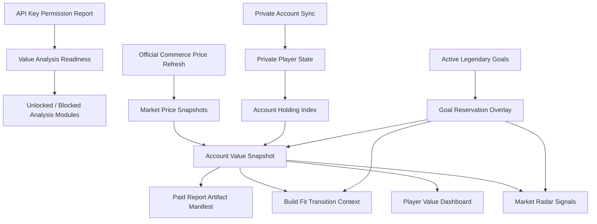

# Account Value, Build Fit, And Market Semantic Maturity Audit

Date: 2026-06-20

## Scope

This audit covers the account-value development line that started from the
`gw2-progression` reference review and now spans API key value readiness,
private holding summaries, conservative account value snapshots, player
dashboard visualization, Legendary/Market reservation safety, Build Fit gear
transition context, and paid report artifact manifests.

## Implemented Semantic Graph

## Mature Capabilities

| Capability | Status | Evidence |
|---|---|---|
| API key value readiness | Implemented | `ApiKeyPermissionReport.value_analysis_readiness`, unlocked/blocked modules |
| Private holding index | Implemented | `AccountHoldingIndex`, `/api/v1/player/account-holdings` |
| Conservative value snapshot | Implemented | `/api/v1/player/account-value`, Markdown/CSV exports |
| Dashboard visualization | Implemented | Account value summary, location/status breakdown, top holdings, warnings |
| Goal reservation overlay | Implemented | `reserved_quantity`, `sellable_surplus_quantity`, `reserved_for_goal_ids` |
| Market sell safety | Implemented | Reserved active-goal materials are not emitted as sell surplus |
| Build Fit value context | Implemented | transition plan value context, reserved/unpriced/account-bound notes |
| Paid report artifact manifest | Implemented | `account_value_snapshot` metadata in report manifest |
| Official commerce price refresh | Implemented | `/api/v1/market/snapshots/official-refresh`, `official_commerce_api` snapshots |
| Shared inventory holdings | Implemented | `/v2/account/inventory` account sync writes `shared_inventory` private holdings |
| Trading-post order holdings | Implemented | Current buy/sell orders sync into `tradingpost_buy` and `tradingpost_sell` holdings when `tradingpost` permission is available |

## Safety Boundaries

- Raw API keys are not returned by permission, holding, value, dashboard,
  market, build, or report APIs.
- Account value snapshots are private summaries, not raw private payload dumps.
- Value calculations are planning estimates only.
- Market output never places orders, automates trades, or guarantees returns.
- Active goal requirements are reserved before any surplus/sell candidate
  interpretation.
- Build Fit never changes gear and treats value context as manual planning
  evidence only.

## Test Coverage

Latest targeted verification covered:

- `tests/test_account_value_holding_index.py`
- `tests/test_do_not_sell_multi_goal.py`
- `tests/test_sell_candidate.py`
- `tests/test_hold_candidate.py`
- `tests/test_no_auto_trading.py`
- `tests/test_market_api.py`
- `tests/test_gear_transition_cost.py`
- `tests/test_build_fit_api.py`
- `tests/test_report_no_secret_leakage.py`
- `tests/test_paid_report_api_routes.py`
- `tests/test_player_ui.py`
- `tests/test_player_dashboard_completion.py`
- `tests/test_official_price_refresh.py`
- `harness/run_account_connection_diagnostic.py`
- `harness/run_player_ui_e2e_smoke.py`
- `harness/run_smoke.py`

## Remaining Gaps

1. Official commerce price refresh now exists for numeric item ids derived from
   account holdings. Symbolic mock ids remain intentionally skipped because they
   are not official `/v2/commerce/prices` ids.
2. Value dashboard is text/list based. Richer charts can be added later, but the
   current MVP intentionally favors deterministic, testable output.
3. Build Fit value context is account-level. Slot-to-item price mapping should
   be refined when build requirements include official item ids.
4. Report manifests include summary metadata. Full per-holding report exports
   should remain opt-in and privacy-gated.

## Next Priority

Proceed to value dashboard remediation depth:

1. expose endpoint-level coverage gaps in the value dashboard;
2. add one-click official price refresh controls to the Player Dashboard;
3. refine Build Fit requirements with official item ids where available;
4. keep per-holding report exports opt-in and privacy-gated;
5. preserve the manual-planning and no-auto-trading boundary.
