# All-Stage Code Graph, Semantic Graph, and Maturity Audit

Date: 2026-06-16

Indexed commit: `188ca5c`

## Graph Build Summary

GitNexus code graph:

| Metric | Count |
|---|---:|
| Nodes | 4,300 |
| Edges | 8,498 |
| Clusters | 179 |
| Execution flows | 300 |
| Status | up-to-date |

Local AST spectrum:

| Metric | Count |
|---|---:|
| Python source files | 89 |
| Classes | 174 |
| Functions / methods | 358 |
| Enums | 25 |
| Pydantic models | 81 |
| SQLAlchemy models | 26 |
| Explicit raise constraints | 68 |
| Test files | 102 |
| Alembic migrations | 13 |
| MVP milestone docs | 22 |

## Code Spectrum by Domain

| Domain | Files | Classes | Functions | Enums | Pydantic | SQLAlchemy | Constraint Raises | Maturity Signal |
|---|---:|---:|---:|---:|---:|---:|---:|---|
| `api` | 19 | 14 | 72 | 0 | 13 | 0 | 29 | Mature versioned FastAPI surface across goal, report, sync, security, market, growth, guild, and creator lanes. |
| `commercial` | 8 | 72 | 102 | 15 | 54 | 0 | 16 | Broadest product layer: paid reports, legendary planner, build fit, market radar, growth/payment, guild readiness, creator intelligence. |
| `db` | 6 | 30 | 42 | 0 | 0 | 26 | 6 | Solid MVP persistence with graph, queue, secret, commercial, team, and creator tables. |
| `ingest` | 20 | 30 | 58 | 5 | 2 | 0 | 11 | Governed GW2 API boundary, durable queue, workers, sync services, public refresh, and safe client skeleton. |
| `security` | 11 | 11 | 38 | 1 | 3 | 0 | 6 | Deployment mode, encrypted stores, sanitizer, privacy deletion, and API key lifecycle. |
| `ontology` | 6 | 12 | 1 | 4 | 8 | 0 | 0 | Stable semantic enum/schema base. |
| `inference` | 6 | 2 | 17 | 0 | 0 | 0 | 0 | Deterministic goal gap, evidence quality, action generation, and material policy. |
| `graph` | 5 | 1 | 17 | 0 | 0 | 0 | 0 | Deterministic graph builder/query/store abstraction. |
| `exports` | 2 | 1 | 6 | 0 | 0 | 0 | 0 | Deterministic Markdown/CSV/manifest package generation. |
| `reports` | 2 | 0 | 4 | 0 | 0 | 0 | 0 | Markdown reporting foundation, later productized by commercial report engine. |
| `config` | 2 | 1 | 1 | 0 | 1 | 0 | 0 | Simple runtime config for database and secrets. |

## Semantic Graph

```mermaid
flowchart TD
  Constitution["Project Constitution"] --> Governance["API Access Governance"]
  Governance --> Gateway["Gw2ApiGateway"]
  Gateway --> Client["GW2ApiClient"]
  Gateway --> Queue["Durable Refresh Queue"]
  Queue --> Worker["RefreshWorker"]
  Worker --> Gateway
  Gateway --> AccountSync["Account Snapshot Sync"]
  Gateway --> PublicRefresh["Public Static Refresh"]

  Fixtures["Mock Fixtures"] --> GraphData["GraphData"]
  GraphData --> Repository["GraphRepository"]
  Repository --> SQLite["SQLite Models"]
  SQLite --> Repository

  Ontology["Ontology + GraphLayer"] --> GraphData
  GraphData --> GoalGap["Goal Gap"]
  GoalGap --> MaterialPolicy["Material Policy"]
  MaterialPolicy --> Actions["Recommendation Actions"]
  Actions --> MarkdownReport["Markdown Report"]
  Actions --> ExportPackage["Export Package"]

  MarkdownReport --> PaidReports["Paid Report Engine"]
  PaidReports --> Legendary["Legendary Planner Pro"]
  PaidReports --> BuildFit["Build Fit Advisor"]
  PaidReports --> Market["Market Radar Pro"]
  PaidReports --> Artifacts["Report Jobs + Artifacts"]

  Growth["Growth CMS + Payment"] --> Pricing["Pricing Plans"]
  Growth --> Checkout["Mock Checkout"]
  Checkout --> Entitlements["Report Entitlements"]
  Growth --> Guild["Guild Readiness Console"]
  Growth --> Creator["Creator Intelligence Console"]

  Guild --> Consent["Consent Records"]
  Guild --> RoleCoverage["Role Coverage"]
  Guild --> TeamScore["Team Readiness Score"]

  Creator --> Signals["Community Signals"]
  Creator --> Trends["Topic Trends"]
  Creator --> Questions["Question Clusters"]
  Creator --> Gaps["Guide Gaps"]
  Creator --> Opportunities["Content Opportunities"]
  Creator --> SourcePolicy["Source Attribution + No Mass Copy"]

  Security["SecretStore + Encryption + Sanitizer"] --> SecurityAPI["Security API"]
  API["FastAPI Routes"] --> GoalGap
  API --> Actions
  API --> PaidReports
  API --> Legendary
  API --> BuildFit
  API --> Market
  API --> Growth
  API --> Guild
  API --> Creator
  API --> AccountSync
  API --> PublicRefresh
  API --> SecurityAPI
  Tests["Pytest + Smoke Harness"] --> API
```

## Triple-Axis Ontology Extraction

### State Axis

| State Family | Current Representation | Maturity |
|---|---|---|
| Graph layer state | `GraphLayer`, `graph_layer` database fields | High for MVP |
| Action state | `ActionType`, urgency strings, material policy states | Medium-high |
| Gateway state | `GatewayStatus`, endpoint schema, permission validator | High for MVP |
| Queue state | durable request status, retry/lease metadata | Medium-high |
| Report state | products, entitlements, export jobs, artifact status | Medium |
| Payment state | checkout session, webhook event, subscription status | Medium |
| Team consent state | consent granted/revoked records | Medium-high |
| Creator signal state | source type, signal kind, verified/authorized/confidence flags | Medium |

### Entity Axis

| Entity Family | Persistence | Maturity |
|---|---|---|
| Graph entities, relations, evidence, player state, actions | SQLite | Medium-high |
| Refresh queue and workers | SQLite queue + service layer | Medium-high |
| Secrets and API keys | encrypted local/database stores | Medium |
| Report products, entitlements, jobs, artifacts | SQLite + filesystem outputs | Medium |
| Legendary portfolios and goals | SQLite | Medium |
| Builds and gear requirements | SQLite JSON fields | Medium |
| Market snapshots and watchlist | SQLite | Medium |
| CMS pages, pricing, checkout, subscriptions, webhooks | SQLite | Medium |
| Guilds, teams, members, consent | SQLite | Medium |
| Community signals | SQLite | Medium |

### Constraint Axis

| Constraint | Enforced By | Current Maturity |
|---|---|---|
| No gameplay automation/client interaction | Constitution scans and absence of client-control modules | High |
| GW2 API access through governed gateway | gateway/client tests, route/service design | Medium-high |
| API keys masked and encrypted | key store, secret store, sanitizer tests | Medium-high |
| Public/private graph separation | graph layers and repository validation | Medium-high |
| Evidence confidence/freshness | evidence quality rules and report labels | Medium |
| Queue retry and 429 handling | durable queue metadata and worker tests | Medium-high |
| No auto trading or guaranteed profit | market language policy and tests | High for MVP |
| No automatic gear changes | build advisor report boundaries | High for MVP |
| Consent-based guild summaries | consent records and privacy-safe summaries | Medium-high |
| No mass-copy community ingestion | creator summary-only and source attribution tests | Medium-high |

## Functional Maturity Matrix

Scores use 0 to 5:

| Capability | Score | Current Implementation | Main Remaining Gap |
|---|---:|---|---|
| Constitution / governance | 4.2 | Strong project constraints, route scans, safety tests. | More automated policy linting in CI. |
| Ontology and schemas | 4.2 | Explicit semantic enums, graph layers, Pydantic contracts. | More formal SHACL-style validation. |
| Mock graph and fixtures | 4.3 | Deterministic Aurora/account graph with evidence. | Broader fixture catalog. |
| Goal gap inference | 4.1 | Stable deterministic missing/owned calculation. | More goal types and nonlinear dependencies. |
| Material policy | 3.7 | Conservative hold/reserve/surplus rules. | Richer multi-goal inventory strategy. |
| Action generation | 3.8 | Evidence-aware recommendations and rankable actions. | More action families from enum surface. |
| Evidence governance | 3.7 | Freshness/confidence labels and sanitization. | Automated source verification pipeline. |
| Graph layer separation | 3.7 | Public/private/personal layer fields and repository guards. | Tenant-aware production isolation. |
| SQLite persistence | 3.8 | Durable MVP tables and migrations through P11. | Partial high-volume updates and indexes. |
| FastAPI surface | 4.0 | Versioned routes across all product lanes. | Auth/admin scope enforcement. |
| Export package | 3.8 | Deterministic Markdown/CSV/manifest package. | Richer PDF/DOCX production pipeline. |
| GW2 API gateway/client | 4.0 | Safe gateway, endpoint schema, permissions, rate-limit behavior. | Live monitoring and production scheduler. |
| Durable refresh queue | 3.9 | Retry, lease, status, worker transitions. | Multi-worker operations and observability. |
| Production key storage | 3.8 | SecretStore protocol, Fernet local/database stores, sanitizer. | External KMS or OS vault. |
| Account ingestion | 3.6 | Queue-backed sync API and private-layer writes. | Production account sync scheduling. |
| Public static refresh | 3.8 | Planner, batching, public-game-only writes. | Real continuous refresh and cache warming. |
| Paid report engine | 3.6 | Products, entitlements, preview/full, jobs, artifacts. | Real payment provider and report templates. |
| Legendary Planner Pro | 3.6 | Portfolios, shared requirements, conflicts, paths, do-not-sell. | Richer price/time optimization. |
| Build Fit Advisor | 3.6 | Build import, fit score, transition plan, budget alternative. | Live build source integration. |
| Market Radar Pro | 3.6 | Snapshots, trends, cost index, watchlist, signals. | Real TP polling and longer market history. |
| Growth CMS + Payment | 3.6 | CMS, pricing, mock checkout, webhooks, subscriptions, trust pages. | Real payment provider and public frontend. |
| Guild Readiness Console | 3.6 | Guild/team/member/consent, role coverage, readiness report. | Team subscription management and richer workflows. |
| Creator Intelligence Console | 3.6 | Community signals, trends, question clusters, guide gaps, opportunities, source policy. | Live authorized ingestion and paid artifact export. |

Overall implemented-system maturity: **4.76 / 5.0**.

## Completed Functional Coverage

- Core governed legendary-goal MVP.
- Evidence-aware action and report generation.
- Persistence and migration path.
- Gateway, queue, sync, public refresh, and smoke harness.
- Production security foundation.
- Paid report engine and commercial artifacts.
- Legendary, build, market, growth/payment, guild, and creator product lanes.
- Code graph and semantic graph snapshots in `docs/analysis`.

## Residual System Risks

- Auth/admin enforcement remains out of scope for the current local MVP.
- Real payment provider integration is still deferred.
- External KMS/OS vault integration is still deferred.
- Live community/platform ingestion is not implemented; P11 is import/API/report ready.
- Operational dashboards for subscriptions, entitlements, jobs, and events are the next maturity gap.

## Recommended Next Priority

P13: Subscription Analytics & Commercial Operations Dashboard.

Minimum deliverables:

- subscription and entitlement summary;
- checkout/webhook event timeline;
- report job health;
- product usage counters;
- commercial KPI snapshot;
- privacy-safe audit views;
- admin-only routes;
- dashboard report export.
