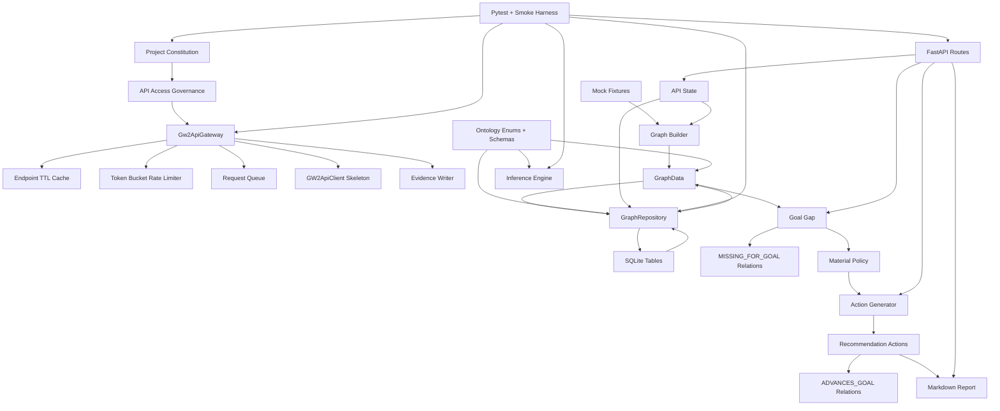

# GW2Radar Code Spectrum and Semantic Graph Analysis

Date: 2026-06-16

Scope: implemented code through MVP 0.1.1 plus Constitution/API Governance baseline.

## Executive Summary

GW2Radar has reached a coherent MVP foundation. The strongest areas are ontology definition, mock legendary-goal inference, recommendation-only action generation, persistence round-trip, API hardening, and governance tests. The least mature areas are real GW2 API integration, asynchronous refresh processing, production key storage, export packaging, and public/private graph partition enforcement beyond tests and documents.

The codebase is currently best described as:

```text
Deterministic mock intelligence engine
+ SQLite persistence
+ FastAPI read/generate/report shell
+ API governance skeleton
+ Constitution compliance tests
```

It is not yet:

```text
Real account ingestion product
Real public GW2 knowledge graph
Production data privacy boundary implementation
Full delivery package exporter
```

## Code Spectrum

Source scan summary:

| Domain | Main Role | Classes | Functions | Maturity |
|---|---:|---:|---:|---|
| ontology | enums and Pydantic semantic contracts | 11 | 1 | High |
| graph | in-memory graph and mock graph builder | 1 | 17 | Medium-High |
| inference | gap, material policy, action generation/ranking | 0 | 12 | Medium-High |
| ingest | gateway, cache, limiter, queue, evidence writer, inert client | 14 | 26 | Medium |
| db | SQLAlchemy models, repository, migration support | 7 | 19 | Medium-High |
| api | FastAPI routes and app state | 0 | 12 | Medium |
| reports | Markdown report rendering | 0 | 3 | Medium |
| config | runtime database setting | 1 | 1 | Medium |
| fixtures | deterministic mock account/goal/items/tasks | 0 | 0 | High for MVP |
| tests | unit, integration, governance, smoke | n/a | n/a | Medium-High |

Current code volume signal:

- 43 Python source files under `src/gw2radar`.
- 34 extracted classes.
- 91 extracted functions/methods.
- 3 core enum classes.
- 8 Pydantic model classes.
- 5 SQLAlchemy persistence tables.
- 21 pytest tests.

## Semantic Graph



## Ontology Triple-Axis Extraction

### State Axis

State-like concepts are encoded as enums and status strings:

| State Family | Current Values | Source |
|---|---|---|
| `EntityType` | account, character, goal, item, material, currency, recipe, achievement, collection, task, action, trading_post_price, source, evidence | `ontology/entity_types.py` |
| `RelationType` | requires, consumes, produces, used_in, unlocks, part_of, owned_by, has_price, missing_for_goal, advances_goal, blocks_goal, reserves_for_goal, reserved_for_goal, acquired_by | `ontology/relation_types.py` |
| `ActionType` | buy, farm, craft, hold, reserve_for_goal, sell_surplus, do_daily, do_weekly, exchange, complete_achievement, complete_collection_step, watch_price, generate_daily_plan, generate_weekly_plan | `ontology/action_types.py` |
| `GatewayStatus` | ok, cache_hit, refresh_pending, rate_limited_retrying | `ingest/gateway_status.py` |
| `QueuedRequest.priority` | P0-P4 policy documented; code default P3 | `ingest/request_queue.py`, `refresh_scheduler.py` |

Maturity: high for MVP. Core values exist, gateway status is an enum, and batch/TTL contracts are tested.

### Entity Axis

| Semantic Entity | Code Representation | Persistence | Notes |
|---|---|---|---|
| Account | `Entity`, `EntityModel`, mock fixture | `entities`, `player_state` | Mock-only account state. |
| Goal | `Entity` with requirements | `entities`, `relations` | Aurora goal implemented. |
| Item/Currency/Achievement | `Entity` and fixture items | `entities`, `player_state` | Enough for Aurora gap analysis. |
| Evidence | `Evidence`, `EvidenceModel`, `EvidenceWriter` | `evidence` | Governance fields added. |
| Relation | `Relation`, `RelationModel` | `relations` | Important mock relations include evidence ids. |
| Action | `Action`, `ActionModel` | `actions` | Recommendation-only constraints and evidence refs present. |
| API Request | `QueuedRequest`, `GatewayResult` | in-memory only | Queue not persisted. |
| Cache Entry | `CacheEntry` | in-memory only | TTL policy implemented in memory. |

Maturity: medium-high for MVP graph, medium for governance/access entities.

### Constraint Axis

| Constraint | Implementation | Test Coverage | Maturity |
|---|---|---|---|
| No gameplay automation | Constitution, action constraints | governance/action tests | Medium |
| No game client interaction | Constitution, no client modules | governance scan | Medium |
| API keys masked | `mask_api_key`, `EvidenceWriter.sanitize_payload` | governance tests | High for MVP |
| External GW2 API only via gateway | gateway skeleton, business-module scan | governance test | Medium |
| 429 backoff path | `Gw2ApiGateway` and limiter penalty | governance test | Medium |
| Cache first / dedupe | `InMemoryCacheStore`, gateway cache key | governance test | Medium |
| Important relations evidence-backed | mock relations use evidence id | graph builder tests | Medium-High |
| Recommendation-only actions | action constraints and explanations | action tests | Medium-High |
| Public/private graph separation | constitution and conceptual graph | not enforced in repository | Low-Medium |
| No proxy/IP rotation | absence plus tests for safe 429 path | governance test | Medium |

## Semantic Capability Maturity

Scores use a 0-5 scale:

| Capability | Score | Assessment |
|---|---:|---|
| Constitution and safety governance | 4.0 | Strong baseline docs and tests; production enforcement hooks still limited. |
| Ontology baseline | 4.0 | Core enums and schemas are explicit and tested. |
| Mock graph construction | 4.0 | Deterministic Aurora graph works and has evidence. |
| Goal gap inference | 4.0 | Rule is simple, deterministic, and tested. |
| Material policy | 3.5 | HOLD/RESERVE logic works; SELL_SURPLUS remains intentionally conservative. |
| Action generation | 3.5 | Required recommendations exist with explanations, evidence refs, constraints, ranking. More action types are enum-only. |
| Markdown report | 3.0 | Required sections exist; report is not yet export-packaged or styled. |
| SQLite persistence | 3.5 | Graph round-trip works; repository is coarse-grained replace/load. |
| FastAPI surface | 3.0 | MVP routes work; no API versioning/auth/error envelope yet. |
| GW2 API access governance | 3.0 | Gateway/cache/limiter/429 skeleton exists with enum statuses, batch helper, TTL tests, and retry metadata. Real client and durable queue are not implemented. |
| Evidence governance | 3.0 | Evidence schema and masking exist; confidence/staleness rules are not yet enforced by inference. |
| Public/private graph separation | 3.0 | `graph_layer` exists on semantic and persistence objects; repository validates private/personal constraints. |
| Test harness | 3.5 | 21 tests plus smoke; coverage is good for MVP but lacks mutation/contract/golden export checks. |
| Delivery export package | 1.0 | Markdown report exists, but package manifest/CSV export is not implemented for GW2Radar. |

Overall maturity: **3.2 / 5.0**

Interpretation: GW2Radar is a solid governed MVP prototype with reliable mock intelligence, not yet a production ingestion/report delivery product.

## Function Maturity by Layer

### Mature Enough for MVP

- Aurora mock goal creation.
- Mock account load.
- Requirement graph relations.
- Player owned quantities.
- Missing quantity inference.
- HOLD / RESERVE / DO_DAILY / COMPLETE_ACHIEVEMENT / WATCH_PRICE recommendations.
- Markdown report generation.
- SQLite graph persistence and reload.
- Constitution compliance tests.

### Partially Mature

- API Gateway: safe skeleton, not a real GW2 API integration.
- Cache and limiter: correct shape, in-memory only.
- Request queue: stores delayed requests, no worker/processor.
- Evidence: fields and sanitization exist, but no staleness/validity enforcement.
- Action schema: rich fields exist, but many enum action types are not generated yet.
- FastAPI: functional MVP routes, no OpenAPI governance tags, API versioning, or auth.

### Immature / Missing

- Report export package with CSV/manifest.
- Durable refresh queue.
- Real GW2 API client with conservative HTTP implementation.
- API key lifecycle: add/delete key endpoints and encrypted storage.
- Public/private graph physical separation.
- Source freshness and low-confidence propagation.
- Batch endpoint abstraction for real item/price/achievement calls.

## Priority Recommendations

### P0: Report Export Package

Reason: Converts current report-only output into a deterministic deliverable, matching the existing MVP direction without taking on real API risk.

Deliverables:

- Markdown report file.
- `goal_gap.csv`.
- `recommended_actions.csv`.
- `package_manifest.json`.
- Smoke check for required files.

### P1: Graph Layer Separation

Reason: Constitution says public/private/personal graphs must be separated. Current graph is conceptually separated but physically merged.

Deliverables:

- `GraphLayer` enum.
- layer field on entities/relations/player state or repository namespaces.
- tests preventing private player state from being saved as public game graph data.

Status: implemented in MVP 0.1.3.

### P2: Gateway Contract Hardening

Reason: Before real GW2 API calls, gateway contracts need stable request/response semantics.

Deliverables:

- `GatewayStatus` enum instead of free strings.
- batch request helper for supported endpoints.
- durable request queue interface.
- endpoint TTL tests.

Status: implemented in MVP 0.1.4.

### P3: Evidence Freshness and Confidence Rules

Reason: Reports should not present stale or low-confidence data as certain.

Deliverables:

- stale evidence check.
- minimum confidence threshold for strong recommendations.
- report labels for mock/stale/low-confidence evidence.

### P4: Real GW2 API Client Skeleton Upgrade

Reason: Only after governance and contracts are firm.

Deliverables:

- conservative HTTP client behind `Gw2ApiGateway`.
- no key logging.
- no proxy/IP rotation.
- batch-only public endpoint helpers where supported.

## Constitution Compliance Assessment

- Does not automate gameplay: pass.
- Does not interact with game client: pass.
- Does not read or modify game memory: pass.
- Does not support RMT/boosting: pass.
- Does not bypass GW2 API rate limits: pass.
- Does not implement proxy pools/IP rotation: pass.
- External API access must go through gateway: partially enforced by scan test.
- API keys are masked: pass for current evidence writer/gateway tests.
- Private/public graph separation: documented, not fully enforced.
- Important relations include evidence references: pass for mock graph.
- Actions are recommendations only: pass for generated actions.
- Market guaranteed-profit language: no current market output.
- Low-confidence data marked as such: schema supports confidence; propagation incomplete.

## Bottom Line

The implemented system has crossed from "code skeleton" to "governed MVP substrate." The highest-value next step is not real GW2 API access yet. It is deterministic export packaging, followed by graph-layer separation and gateway contract hardening. That sequence keeps the project aligned with the constitution while making the product more tangible.
