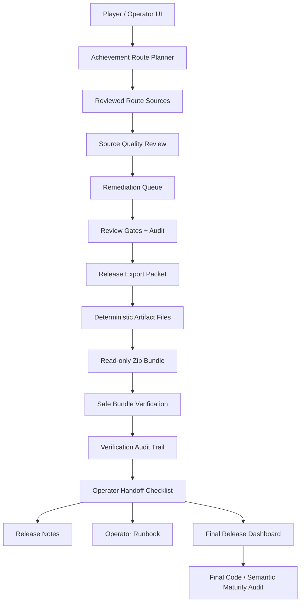

# GW2Radar Final Project Acceptance And Graph Audit

Date: 2026-06-20

## Executive Summary

The current repository is ready for final internal acceptance of the implemented MVP and post-MVP player/operator workflows.

GitNexus was rebuilt after the latest release closure commit:

| Metric | Value |
|---|---:|
| Indexed commit | `9e1f8f4` |
| Current commit at analysis time | `9e1f8f4` |
| GitNexus status | up-to-date |
| Graph nodes | 12,526 |
| Graph edges | 26,186 |
| Clusters | 486 |
| Flows | 300 |

Player UI semantic audit status:

| Metric | Value |
|---|---:|
| Complete items | 83 |
| Partial items | 0 |
| Missing items | 0 |
| Final maturity audit implemented stage count | 34 |

## Code Graph Findings

The codebase now has a broad but coherent structure:

| Area | Maturity |
|---|---|
| `api/routes` | Mature. Versioned FastAPI routes cover account sync, support review, KB, commercial reports, and achievement-route release operations. |
| `commercial` | Mature for MVP/internal alpha. This is the densest business layer and now includes release packet, artifact, bundle, verification, audit, handoff, notes, runbook, dashboard, and final maturity models. |
| `ingest` | Mature for governed GW2 API access and diagnostic flows. Real API key handling remains bounded by security/privacy constraints. |
| `security` | Mature MVP boundary: encrypted key store, log sanitization, deployment mode, privacy deletion, and no raw key leakage tests. |
| `kb` / `kb_pdf` | Medium-high. Source registry, patch/news processing, reviewed rules, report integration, and PDF-derived knowledge pipelines exist; quality still depends on continued human review. |
| `ui/static` | Mature for local operator/player workbench. It is dense but complete for current scope. |
| `tests` / `harness` | Mature. The achievement-route harness now exercises the complete P1-P34 release/operator chain. |

Current code graph evidence:

- `src/gw2radar/commercial/achievement_route.py` contains the complete achievement-route planning and release handoff domain model.
- `src/gw2radar/api/routes/achievement_routes.py` exposes JSON / Markdown / CSV / manifest / zip endpoints for the release chain.
- `src/gw2radar/ui/static/player.html` and `src/gw2radar/ui/static/app.js` expose the player/operator controls.
- `harness/run_achievement_route_smoke.py` verifies the end-to-end operator chain through final maturity audit.

## Semantic Graph Findings



Semantic maturity status:

| Capability | Status |
|---|---|
| Manual player planning | Complete |
| Account connection diagnostics | Complete |
| Commercial report artifacts | Complete for local/internal scope |
| Knowledge-backed explanations | Complete at reviewed-rule MVP depth |
| Achievement route source promotion | Complete |
| Release packet export | Complete |
| Local artifact files | Complete |
| Bundle download | Complete |
| Safe bundle verification import | Complete |
| Verification audit trail | Complete |
| Operator handoff checklist | Complete |
| Release notes and runbook | Complete |
| Final release dashboard and maturity audit | Complete |

## Verification Results

Latest verified commands:

```powershell
pytest tests\test_achievement_route.py -q
pytest tests\test_player_ui.py -q
python harness\run_achievement_route_smoke.py
python harness\run_smoke.py
$env:PYTHONIOENCODING='utf-8'; pytest -q
```

All listed checks passed after P31-P34.

## User Guide Acceptance

Primary guide for senior players:

- `docs/analysis/SENIOR_PLAYER_USER_GUIDE.md`

Primary UI/operator guide:

- `docs/ui/PLAYER_UI_GUIDE.md`

Final release/operator endpoints exposed from the player UI:

- Release export packet
- Packet files
- Packet bundle
- Bundle verification
- Bundle verification audit
- Handoff checklist
- Release notes
- Operator runbook
- Final release dashboard
- Final maturity audit

## External Data Import

External data enters the system through these safe boundaries:

| Data | Entry |
|---|---|
| Real GW2 API key | Account connection API / encrypted key store |
| Official public API data | Governed GW2 API gateway and public refresh flows |
| Official docs / PDFs | `docs/knowledge_base/_sources` and KB processing tools |
| Reviewed KB rules | Source registry, review gates, import/enable flows |
| Release bundle zip | Verification import endpoint, read-only bytes, no execution |

The system preserves the boundary between user-provided facts, reviewed sources, generated recommendations, and operator metadata.

## Untracked Asset Strategy

Current untracked items are intentionally not committed by default:

| Group | Strategy |
|---|---|
| `desktop.ini` files | Ignore as Windows filesystem noise. |
| `docs/knowledge_base/_sources/` | Treat as local source asset cache; commit only curated derived Markdown/registry outputs. |
| Imported planning specs in `docs/analysis/` | Review individually before committing; many are source references rather than product docs. |
| `src/gw2radar/reports/artifacts/` | Keep untracked; generated report/release artifacts are local outputs. |
| `agent_execution_pack_v1_1.zip` | Keep untracked unless explicitly promoted as a release asset. |

## Known Limits

- This is not an automated deployment or publishing system.
- Release readiness does not certify live Guild Wars 2 state.
- Market outputs remain planning guidance only and do not automate trading or guarantee profit.
- KB/PDF-derived knowledge still requires human review for high-confidence rule promotion.
- The local player/operator UI is feature-complete for current scope, but visual polish and long-running workflow ergonomics can still improve.

## Final Acceptance

Acceptance status: ready for internal alpha / seed-user review.

Recommended next step: freeze this release line, tag a release candidate after the user confirms the final report, and begin a separate hardening track for packaging, UX polish, and curated KB quality.
