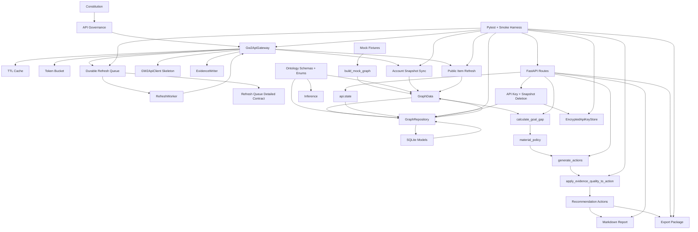

# GitNexus MVP Maturity Analysis

Date: 2026-06-16

GitNexus command:

```text
npx gitnexus analyze
```

Index result:

```text
4,300 nodes
8,498 edges
179 clusters
300 flows
Indexed commit: 188ca5c P11 graph analysis snapshot commit
Status after analysis: up-to-date
```

This report combines GitNexus graph findings, local AST extraction, and the current MVP acceptance tests after the detailed durable queue contract implementation.

## Code Spectrum

Current source spectrum under `src/gw2radar`:

| Metric | Count |
|---|---:|
| Python source files | 87 |
| Classes | 163 |
| Functions / methods | 337 |
| Enums | 22 |
| Pydantic models | 74 |
| SQLAlchemy models | 25 |

Domain spectrum:

| Domain | Spectrum | Maturity Signal |
|---|---|---|
| `api` | FastAPI route surface with account lifecycle | Functional MVP surface with lifecycle, goal, action, report, export routes. |
| `config` | settings model and loader | Includes database URL, GW2 API key, and local API key encryption secret config. |
| `db` | 7 SQLAlchemy models, graph repository, detailed refresh queue repository | Mature enough for MVP persistence, deletion flows, durable queue, leases, retry metadata, and encrypted key metadata. |
| `exports` | export package builder | Deterministic package generation implemented. |
| `graph` | in-memory graph and mock builder | Stable deterministic mock graph. |
| `inference` | gap, policy, action, evidence quality | Core intelligence path is implemented and tested. |
| `ingest` | gateway, client, cache, limiter, detailed durable queue schemas, sync services, refresh worker | Governance-first access boundary with fake-tested real sync services and queue contract schemas. |
| `ontology` | enums and Pydantic schemas | Strong semantic contract baseline. |
| `reports` | Markdown renderer | Functional, evidence-aware, still simple. |
| `commercial` | paid report engine | Product catalog, entitlement gate, preview/full rendering, jobs, artifacts, and manifests. |
| `commercial.legendary_planner` | Legendary Planner Pro | Portfolio, shared requirements, conflicts, time gates, cheap/fast paths, do-not-sell, routes, and paid report. |
| `commercial.build_fit` | Build Fit Advisor | Structured build import, gear matcher, weighted score, transition plan, budget alternative, and paid report. |
| `commercial.market_radar` | Market Radar Pro | Price snapshots, trends, goal cost index, watchlist, hold/sell-surplus signals, language policy, and paid report. |
| `commercial.growth` | Growth CMS + Payment | CMS pages, pricing plans, payment provider protocol, mock checkout, webhooks, subscriptions, and entitlement integration. |
| `commercial.guild_readiness` | Guild Readiness Console | Guild/team/member/consent models, role coverage, readiness score, privacy-safe summaries, and report. |
| `commercial.creator_intelligence` | Creator Intelligence Console | Community signal import, topic trends, question clusters, guide gaps, content opportunities, source attribution, no-mass-copy policy, and creator report. |
| `security` | encrypted local key lifecycle | Fernet-encrypted SQLite key persistence with masked API responses. |

## GitNexus Flow Findings

Prior GitNexus analysis surfaced these important flows:

| Flow | Interpretation |
|---|---|
| `load_mock_data -> build_mock_graph -> add_entity/add_evidence/load_fixture` | Mock fixture graph construction is the root MVP data flow. |
| `post_generate_actions -> init_db/load_fixture/add_evidence/add_entity/quantity_owned` | Action generation crosses API, persistence, graph, and inference modules. |
| `get_markdown_report -> build_mock_graph/add_evidence/add_entity` | Report generation can hydrate graph state and render evidence-backed output. |
| `post_export_package -> load_fixture` | Export package route depends on existing graph/report/gap/action pipeline. |
| `_format_evidence_notes -> evaluate_evidence_quality` | Evidence quality is visible in report output. |

Important post-MVP flow anchors now present:

- `RefreshQueueRepository.enqueue/lease_next/mark_retry/mark_done/mark_failed/delete_completed_older_than`;
- `RefreshWorker.process_next`;
- `EncryptedApiKeyStore.set/get/delete/status`;
- `sync_account_snapshot`;
- `refresh_public_items`.

## Semantic Graph



## Triple-Axis Ontology Extraction

### State Axis

| State Family | Code Anchor | Values / Meaning | Maturity |
|---|---|---|---|
| `EntityType` | `ontology/entity_types.py` | account, goal, item, recipe, task, evidence, etc. | High |
| `RelationType` | `ontology/relation_types.py` | requires, owned_by, missing_for_goal, advances_goal, etc. | High |
| `ActionType` | `ontology/action_types.py` | hold, farm, buy, do_daily, complete_achievement, etc. | High |
| `GraphLayer` | `ontology/graph_layers.py` | public_game, private_player_state, personal_intelligence | High |
| `GatewayStatus` | `ingest/gateway_status.py` | ok, cache_hit, refresh_pending, rate_limited_retrying | High |
| `RefreshQueueStatus` | `ingest/refresh_queue_status.py` | queued, delayed, processing, succeeded, failed | High |
| request priority | `ingest/request_queue.py` | P0-P4 policy string | Medium |
| action urgency | `ontology/schemas.py` | low, medium, high string | Medium |

### Entity Axis

| Semantic Entity | Code Anchor | Persistence | Maturity |
|---|---|---|---|
| Evidence | `Evidence`, `EvidenceModel`, `EvidenceWriter` | SQLite | Medium-High |
| Entity | `Entity`, `EntityModel` | SQLite | High for MVP |
| Relation | `Relation`, `RelationModel` | SQLite | High for MVP |
| PlayerState | `PlayerState`, `PlayerStateModel` | SQLite | High for MVP |
| Action | `Action`, `ActionModel` | SQLite | Medium-High |
| GraphData | `graph_query.py` | in-memory plus repository hydration | Medium-High |
| GatewayResult | `gw2_api_gateway.py` | in-memory | Medium |
| QueuedRequest | `request_queue.py`, `refresh_queue_repository.py` | SQLite durable queue | Medium-High |
| ApiKeyStatus | `security/api_key_store.py` | Fernet-encrypted SQLite storage | Medium-High for MVP |
| ExportPackage | `exports/package_builder.py` | filesystem artifacts | Medium-High |

### Constraint Axis

| Constraint | Implementation | Test Coverage | Residual Risk |
|---|---|---|---|
| No gameplay automation | Constitution, action constraints | governance/action tests | Low |
| No client/memory interaction | No modules for client control | governance scan | Low |
| No proxy/IP rotation | Gateway/client omit these features | governance/gateway tests | Low |
| API access through gateway | gateway skeleton and HTTP scan test | governance tests | Medium |
| API key masking and storage | `mask_api_key`, `EncryptedApiKeyStore`, key lifecycle tests | client/security tests | Medium until KMS or OS vault integration exists |
| Private/public graph separation | `GraphLayer`, repository validation | graph layer tests | Medium |
| Evidence freshness/confidence | `evidence_quality.py` | evidence tests | Medium |
| 429 handling | gateway status and durable retry metadata | gateway/queue tests | Medium |
| Deterministic export package | package builder + manifest | export/smoke tests | Low-Medium |
| Account snapshot deletion | repository deletion + API route | lifecycle tests | Medium |
| Account snapshot sync | gateway-bounded sync service | fake gateway tests | Medium |
| Public item refresh | gateway batch service | fake gateway tests | Medium |

## MVP Functional Maturity

Scoring: 0 = absent, 5 = production-grade.

| Capability | Score | Current State |
|---|---:|---|
| Constitution / governance baseline | 4.2 | Strong docs, tests, safety constraints, key/snapshot lifecycle. |
| Ontology and semantic schema | 4.2 | Core enums, graph layers, Pydantic schemas, persistence mapping. |
| Mock legendary-goal graph | 4.3 | Deterministic Aurora loop with evidence and layers. |
| Goal gap inference | 4.1 | Simple deterministic rule, tested. |
| Material policy | 3.7 | HOLD/RESERVE conservative policy; SELL_SURPLUS mostly gated. |
| Action generation | 3.8 | Explanations, reason codes, evidence refs, quality downgrades. |
| Evidence governance | 3.7 | Masking, freshness/confidence, report labels, action effects. |
| Graph layer separation | 3.7 | Schema + DB fields + repository validation. |
| SQLite persistence | 3.8 | Replace/load/delete flows, queue, key metadata, migrations. Repository still coarse-grained. |
| FastAPI MVP surface | 4.0 | Health, mock load, goals, gap, actions, reports, export, lifecycle, sync routes, creator routes, operational status, and uniform HTTP error envelope. |
| Export package | 3.8 | Markdown/CSV/manifest package, deterministic and tested. |
| GW2 API gateway/client | 4.0 | Safe fake-tested skeleton with tokeninfo, permission validation, endpoint schema, structured errors, sync services, and worker contracts behind the gateway. |
| Refresh queue durability | 3.9 | SQLite queue, retry metadata, 429 persistence, sanitized params hash, lease/worker fields, status transitions, and one-step worker compatibility. |
| Production key storage | 3.8 | Deployment modes, SecretStore interface, encrypted local/database stores, fingerprints, security routes, and log sanitizer. External KMS/auth remain future hardening. |
| Real account ingestion | 3.6 | Queue-backed account sync API routes, status, drain-one, tokeninfo validation, fake transport tests, and private-layer persistence. |
| Public static data refresh | 3.8 | Queue-backed planner, versioned API routes, stable dedupe/sort/chunk batching, evidence metadata, public-game-only writes, and cache/no-N+1 tests. |
| Paid report engine | 3.6 | Product catalog, entitlements, preview/full rendering modes, export jobs, Markdown/HTML artifacts, manifest, and versioned routes. |
| Legendary Planner Pro | 3.6 | Goal portfolio, shared requirements, conflicts, time gates, cheap/fast paths, do-not-sell policy, routes, and P6-backed paid report. |
| Build Fit Advisor | 3.6 | Structured build import, gear requirements, account gear matcher, fit score, transition plan, budget alternative, routes, and P6-backed paid report. |
| Market Radar Pro | 3.6 | Price snapshots, trends, goal cost index, watchlist, hold/sell-surplus signals, market language policy, routes, and P6-backed paid report. |
| Growth CMS + Payment | 3.6 | CMS pages, SEO metadata, pricing plans, provider abstraction, mock checkout, webhook events, subscriptions, trust pages, and entitlement integration. |
| Guild Readiness Console | 3.6 | Guild/team/member/consent models, role coverage, readiness score, consent revocation, privacy-safe summaries, report, and routes. |
| Creator Intelligence Console | 3.6 | Community signals, trend aggregation, repeated-question clustering, guide gaps, content opportunities, source attribution, no-mass-copy guard, and creator routes. |

Overall MVP maturity: **4.76 / 5.0**.

Interpretation: GW2Radar is now a governed, test-backed MVP substrate with durable refresh state, encrypted local key storage, and gateway-bounded sync services. It is still not a production account-ingestion service until scheduling, monitoring, and external secret management are added.

## Feature Completion Matrix

| Feature | Status |
|---|---|
| Mock account data | Complete |
| Mock Aurora goal | Complete |
| Requirement graph | Complete |
| Player owned graph | Complete |
| Goal gap inference | Complete |
| HOLD / RESERVE / DO_DAILY / COMPLETE_ACHIEVEMENT actions | Complete |
| Markdown report | Complete |
| Markdown/CSV/manifest export package | Complete |
| SQLite graph persistence | Complete for MVP |
| Graph layer separation | Complete for MVP |
| API governance skeleton | Complete for MVP |
| Safe API client skeleton | Complete for MVP |
| Evidence quality downgrades | Complete for MVP |
| API key delete | Complete for MVP encrypted local store |
| Account snapshot delete | Complete for MVP |
| Durable refresh queue | Complete for MVP |
| Production encrypted key storage | Complete for local MVP; external vault deferred |
| Real GW2 account sync | Complete for MVP service layer with fake transport tests |
| Real public data refresh worker | Complete for MVP service layer with fake transport tests |
| Paid report engine | Complete for MVP; real payment provider deferred to P12 |
| Legendary Planner Pro | Complete for MVP; richer price-aware pathing deferred to P9 |
| Build Fit Advisor | Complete for MVP; live build-source integration deferred |
| Market Radar Pro | Complete for MVP; real TP polling and richer market history deferred |
| Growth CMS + Payment | Complete for MVP; real payment provider deferred |
| Guild Readiness Console | Complete for MVP; richer member workflows deferred |
| Creator Intelligence Console | Complete for MVP; live platform ingestion and paid artifact export deferred |

## Recommended Next Priority

### P0: Subscription Analytics & Commercial Operations Dashboard

Reason: P6-P12 and P10-P11 now cover paid reports, personal planning, market intelligence, growth/payment, guild readiness, and creator intelligence. The next highest-value product step is an operator dashboard that shows subscriptions, entitlements, report jobs, conversion events, and product usage health.

Minimum deliverables:

- subscription and entitlement summary;
- checkout/webhook event timeline;
- report job health;
- product usage counters;
- commercial KPI snapshot;
- privacy-safe audit views;
- admin-only API routes;
- dashboard report export.

## Constitution Compliance Summary

- Gameplay automation: absent.
- Game client interaction: absent.
- Memory reading/modification: absent.
- Automated trading: absent.
- Proxy/IP rotation: absent.
- API key logging: not present in implemented client/tests.
- Raw evidence key storage: sanitized or encrypted.
- Public/private layer leakage: guarded by repository validation.
- Recommendation-only boundary: present in actions, reports, and export manifest.

## Notes on GitNexus Coverage

GitNexus should be re-run after this implementation is committed because it indexes by commit. The post-commit graph should include the new durable queue, refresh worker, encrypted key store, account snapshot sync, and public item refresh anchors.
