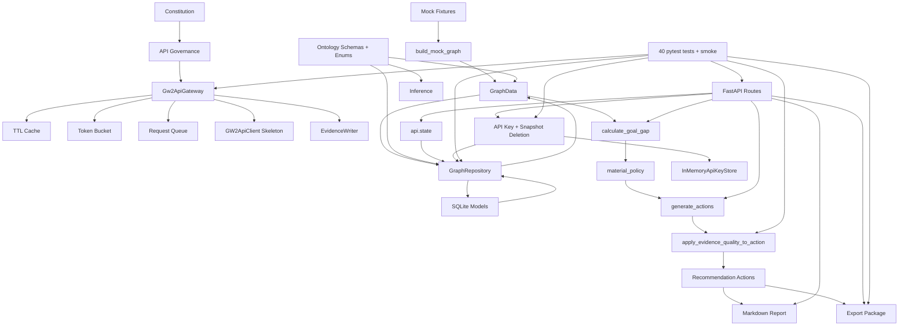

# GitNexus MVP Maturity Analysis

Date: 2026-06-16

GitNexus command:

```text
npx gitnexus analyze
```

Index result:

```text
1,242 nodes
2,132 edges
38 clusters
62 flows
Indexed commit: 185533e
Status after analysis: up-to-date
```

This report combines GitNexus graph findings with local AST extraction and the current MVP acceptance tests.

## Code Spectrum

Current source spectrum under `src/gw2radar`:

| Metric | Count |
|---|---:|
| Python source files | 51 |
| Classes | 44 |
| Functions / methods | 122 |
| Enums | 5 |
| Pydantic models | 10 |
| SQLAlchemy models | 5 |

Domain spectrum:

| Domain | Spectrum | Maturity Signal |
|---|---|---|
| `api` | 18 functions, 1 Pydantic request model | Functional MVP surface with lifecycle, goal, action, report, export routes. |
| `config` | 1 settings model, 1 loader | Simple and adequate for MVP; no secret persistence. |
| `db` | 5 SQLAlchemy models, repository, validators | Mature enough for MVP persistence and deletion flows. |
| `exports` | export package builder | Deterministic package generation implemented. |
| `graph` | in-memory graph and mock builder | Stable deterministic mock graph. |
| `inference` | gap, policy, action, evidence quality | Core intelligence path is implemented and tested. |
| `ingest` | gateway, client, cache, limiter, queue | Governance-first access boundary; real sync not yet productized. |
| `ontology` | 4 enums, 8 Pydantic models | Strong semantic contract baseline. |
| `reports` | Markdown renderer | Functional, evidence-aware, still simple. |
| `security` | in-memory key lifecycle | Safe MVP behavior, not production encrypted storage. |

## GitNexus Flow Findings

GitNexus surfaced these important flows:

| Flow | Interpretation |
|---|---|
| `load_mock_data -> build_mock_graph -> add_entity/add_evidence/load_fixture` | Mock fixture graph construction is the root MVP data flow. |
| `post_generate_actions -> init_db/load_fixture/add_evidence/add_entity/quantity_owned` | Action generation crosses API, persistence, graph, and inference modules. |
| `get_markdown_report -> build_mock_graph/add_evidence/add_entity` | Report generation can hydrate graph state and render evidence-backed output. |
| `post_export_package -> load_fixture` | Export package route depends on existing graph/report/gap/action pipeline. |
| `_format_evidence_notes -> evaluate_evidence_quality` | Evidence quality is now visible in report output. |

Key GitNexus definition hits:

- `GraphRepository`
- `GraphRepository.delete_account_snapshot`
- `validate_graph_layers`
- `GraphLayer`
- `GraphData`
- `EvidenceQuality`
- `EvidenceQualitySummary`
- `InMemoryApiKeyStore`
- `Gw2ApiGateway`
- gateway and graph governance tests

## Semantic Graph



## Triple-Axis Ontology Extraction

### State Axis

| State Family | Code Anchor | Values / Meaning | Maturity |
|---|---|---|---|
| `EntityType` | `ontology/entity_types.py` | account, goal, item, recipe, task, evidence, etc. | High |
| `RelationType` | `ontology/relation_types.py` | requires, owned_by, missing_for_goal, advances_goal, etc. | High |
| `ActionType` | `ontology/action_types.py` | hold, farm, buy, do_daily, complete_achievement, etc. | High |
| `GraphLayer` | `ontology/graph_layers.py` | public_game, private_player_state, personal_intelligence | High |
| `GatewayStatus` | `ingest/gateway_status.py` | ok, cache_hit, refresh_pending, rate_limited_retrying | High |
| request priority | `ingest/request_queue.py` | P0-P4 policy string | Medium |
| action urgency | `ontology/schemas.py` | low, medium, high string | Medium |

### Entity Axis

| Semantic Entity | Code Anchor | Persistence | Maturity |
|---|---|---|---|
| Evidence | `Evidence`, `EvidenceModel`, `EvidenceWriter` | SQLite | Medium-High |
| Entity | `Entity`, `EntityModel` | SQLite | High for MVP |
| Relation | `Relation`, `RelationModel` | SQLite | High for MVP |
| PlayerState | `PlayerState`, `PlayerStateModel` | SQLite | High for MVP |
| Action | `Action`, `ActionModel` | SQLite | Medium-High |
| GraphData | `graph_query.py` | in-memory plus repository hydration | Medium-High |
| GatewayResult | `gw2_api_gateway.py` | in-memory | Medium |
| QueuedRequest | `request_queue.py` | in-memory | Medium-Low |
| ExportPackage | `exports/package_builder.py` | filesystem artifacts | Medium-High |
| ApiKeyStatus | `security/api_key_store.py` | in-memory only | Medium for MVP |

### Constraint Axis

| Constraint | Implementation | Test Coverage | Residual Risk |
|---|---|---|---|
| No gameplay automation | Constitution, action constraints | governance/action tests | Low |
| No client/memory interaction | No modules for client control | governance scan | Low |
| No proxy/IP rotation | Gateway/client omit these features | governance/gateway tests | Low |
| API access through gateway | gateway skeleton and HTTP scan test | governance tests | Medium |
| API key masking | `mask_api_key`, key lifecycle, fake transport tests | client/security tests | Medium until production storage exists |
| Private/public graph separation | `GraphLayer`, repository validation | graph layer tests | Medium |
| Evidence freshness/confidence | `evidence_quality.py` | evidence tests | Medium |
| 429 handling | gateway status and queue metadata | gateway tests | Medium |
| Deterministic export package | package builder + manifest | export/smoke tests | Low-Medium |
| Account snapshot deletion | repository deletion + API route | lifecycle tests | Medium |

## MVP Functional Maturity

Scoring: 0 = absent, 5 = production-grade.

| Capability | Score | Current State |
|---|---:|---|
| Constitution / governance baseline | 4.2 | Strong docs, tests, safety constraints, key/snapshot lifecycle. |
| Ontology and semantic schema | 4.2 | Core enums, graph layers, Pydantic schemas, persistence mapping. |
| Mock legendary-goal graph | 4.3 | Deterministic Aurora loop with evidence and layers. |
| Goal gap inference | 4.1 | Simple deterministic rule, tested. |
| Material policy | 3.7 | HOLD/RESERVE conservative policy; SELL_SURPLUS mostly gated. |
| Action generation | 3.8 | Explanations, reason codes, evidence refs, quality downgrades. |
| Evidence governance | 3.7 | Masking, freshness/confidence, report labels, action effects. |
| Graph layer separation | 3.7 | Schema + DB fields + repository validation. |
| SQLite persistence | 3.7 | Replace/load/delete flows, migrations. Repository still coarse-grained. |
| FastAPI MVP surface | 3.5 | Health, mock load, goals, gap, actions, reports, export, lifecycle. |
| Export package | 3.8 | Markdown/CSV/manifest package, deterministic and tested. |
| GW2 API gateway/client | 3.2 | Safe fake-tested skeleton. No real sync worker yet. |
| Refresh queue durability | 1.5 | In-memory queue only. |
| Production key storage | 1.5 | In-memory only; encryption intentionally deferred. |
| Real account ingestion | 1.0 | Client skeleton exists; no account snapshot sync pipeline. |

Overall MVP maturity: **3.55 / 5.0**.

Interpretation: GW2Radar is now a governed, test-backed MVP substrate. It can generate deterministic legendary-goal intelligence packages from mock data and has safety boundaries for future real API work. It is not yet a production account-ingestion system.

## Feature Completion Matrix

| Feature | Status |
|---|---|
| Mock account data | Complete |
| Mock Aurora goal | Complete |
| Requirement graph | Complete |
| Player owned graph | Complete |
| Goal gap inference | Complete |
| HOLD / RESERVE / DO_DAILY / COMPLETE_ACHIEVEMENT actions | Complete |
| Markdown report | Complete |
| Markdown/CSV/manifest export package | Complete |
| SQLite graph persistence | Complete for MVP |
| Graph layer separation | Complete for MVP |
| API governance skeleton | Complete for MVP |
| Safe API client skeleton | Complete for MVP |
| Evidence quality downgrades | Complete for MVP |
| API key delete | Complete for MVP memory-only store |
| Account snapshot delete | Complete for MVP |
| Durable refresh queue | Not implemented |
| Production encrypted key storage | Not implemented |
| Real GW2 account sync | Not implemented |
| Real public data refresh worker | Not implemented |

## Recommended Next Priority

### P0: Durable Refresh Queue

Reason: GitNexus shows the access/governance path now has gateway, limiter, queue, client, and evidence writer, but the queue is still in-memory. Before any real account sync or public data refresh, retry tasks must survive process restarts and have clear state transitions.

Minimum deliverables:

- SQLite `refresh_queue` table.
- `RefreshQueueStatus` enum: queued, delayed, processing, succeeded, failed.
- repository for enqueue/list/mark_retry/mark_done/mark_failed.
- no background worker yet unless explicitly scoped.
- tests proving 429 retry metadata persists.

### P1: Account Snapshot Sync Pipeline

Only after durable queue exists:

- use `Gw2ApiGateway`;
- use fake transport in tests;
- no real key snapshots;
- write private player state into private layer only.

### P2: Public Static Data Refresh

Only after queue and account sync contract:

- batch public endpoints;
- cache TTLs;
- public_game layer only.

## Constitution Compliance Summary

- Gameplay automation: absent.
- Game client interaction: absent.
- Memory reading/modification: absent.
- Automated trading: absent.
- Proxy/IP rotation: absent.
- API key logging: not present in implemented client/tests.
- Raw evidence key storage: sanitized.
- Public/private layer leakage: guarded by repository validation.
- Recommendation-only boundary: present in actions, reports, and export manifest.

## Notes on GitNexus Coverage

GitNexus indexed the repository at commit `185533e`, which matches the current HEAD when analysis was run. The graph reported 62 flows and highlighted the core MVP paths:

- mock load;
- action generation;
- markdown reporting;
- export package;
- evidence quality formatting;
- graph layer validation;
- account snapshot deletion;
- gateway governance.

The analysis should be re-run after the next implementation milestone because GitNexus indexes by commit.
