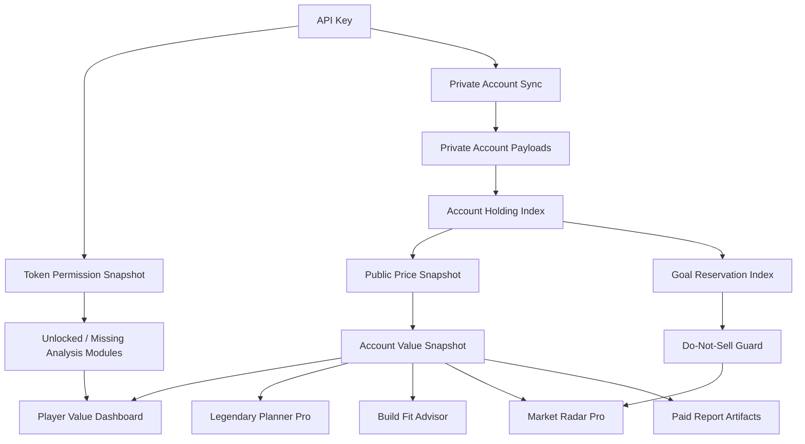

# GW2 Progression API Key Value And Visualization Borrowing Plan

Date: 2026-06-20

Reference project: `D:\Projects\gw2-progression`

## Purpose

This note evaluates which API-key value-analysis and visualization patterns from
`gw2-progression` should influence GW2Radar. The goal is not to copy the
reference app wholesale. GW2Radar should borrow its account-value semantics,
permission-aware onboarding, and visualization grammar while keeping GW2Radar's
existing privacy boundary, graph layers, report artifacts, and advisory-only
commercial positioning.

## Reference Findings

`gw2-progression` is a compact Python/FastAPI local account dashboard. Its most
useful implementation areas are:

1. API key permission inspection.
   - `/v2/tokeninfo` validates the key and drives a granted/missing permission
     grid.
   - Each account feature is gated by the required permission instead of failing
     the whole analysis.

2. Account holdings normalization.
   - Wallet, material storage, bank, character bags, shared inventory, and
     trading-post orders are normalized into an `ItemHolding`-like model.
   - Holdings preserve location, count, binding status, tradability, price,
     value, and valuation status.

3. Value analysis.
   - Market prices are fetched for unpriced item ids.
   - Account-bound and no-price items are explicitly separated from priced
     items.
   - Summary values are grouped by wallet, material storage, bank, character
     inventory, shared inventory, and trading post.
   - Net sell value applies the 15 percent trading post fee as an explicit
     conservative assumption.

4. User-facing visual explanation.
   - The dashboard shows permission badges, account overview cards, wallet,
     inventory, progression, unlocks, WvW, PvP, and character equipment.
   - It has a useful concept of "what is present, what is missing, and what is
     unpriced", which is exactly the kind of player-facing transparency GW2Radar
     needs.

5. Operational lessons.
   - The reference app is local-first and avoids sending the key to a third
     party.
   - It uses a small, deterministic service pipeline that is easy to fixture in
     tests.

## Current GW2Radar Baseline

GW2Radar already has mature infrastructure that should remain the system of
record:

1. API key safety.
   - Key normalization, encrypted/local secret store abstractions, permission
     inspection, no raw key response leakage, delete endpoints, and support
     debug bundles.

2. Account sync.
   - Queue, status, drain-one development path, private-layer graph writes, and
     endpoint-level account sync status for profile, characters, wallet,
     materials, bank, and achievements.

3. Commercial intelligence.
   - Legendary Planner Pro, Build Fit, Market Radar Pro, player dashboard,
     freshness annotations, report artifacts, and KB-backed explanations.

4. Graph and release governance.
   - Public/private/derived graph-layer separation, source confidence,
     metadata-only audit trails, release packets, and smoke harness coverage.

The main maturity gap is not key connection. It is player-visible value
translation: after a key is connected, the player should immediately see what
analysis was unlocked, what account value/progression was detected, why results
may be incomplete, and how that changes Legendary, Build Fit, Market Radar, and
Achievement Route decisions.

## Borrowing Boundary

Borrow:

- Holding normalization semantics.
- Valuation status vocabulary: `priced`, `unpriced`, `no_price`,
  `account_bound`, `missing_permission`, `stale_price`.
- Location breakdown model.
- Conservative net sell assumptions.
- Permission-to-feature impact mapping.
- Dashboard patterns that make missing data visible.

Do not borrow directly without review:

- Raw code, unless license and attribution are explicitly accepted.
- Local-only privacy assumptions that conflict with GW2Radar's encrypted secret
  store and private graph layer.
- Any UI that turns account value into profit guarantees or sell advice.
- Any valuation that ignores active goals, do-not-sell reservations, stale price
  windows, or account-bound ambiguity.

## Target Semantic Graph

## Priority Plan

### P0: API Key Value Diagnostic

Goal: make "connected but no output" impossible to misunderstand.

Tasks:

1. Extend the account permission response with `unlocked_analysis_modules`,
   `blocked_analysis_modules`, and `value_analysis_readiness`.
2. Add a player-visible diagnostic section that explains which modules are
   available from the current scopes:
   - Account overview: `account`
   - Wallet value: `wallet`
   - Material value: `inventories`
   - Bank/shared inventory value: `inventories`
   - Character inventory and gear: `characters` plus `inventories`
   - Trading-post orders: `tradingpost`
   - Build templates: `builds`
   - Progression and achievement route context: `progression`
3. Add empty-state messages for each blocked module instead of silent panels.
4. Harness: extend `run_account_connection_diagnostic.py` to assert readiness,
   missing permission copy, and no raw key leakage.

Acceptance:

- A valid key with limited scopes produces a useful limited-mode explanation.
- A valid key with full scopes exposes value-analysis readiness.
- No response contains the raw API key.

### P1: Private Account Holding Index

Goal: normalize private account data into a reusable semantic layer.

Tasks:

1. Add an `AccountHolding` model under the private/derived boundary.
2. Extract wallet gold, materials, bank slots, shared inventory, character bags,
   and current trading-post orders when available.
3. Preserve item id, count, location type, location ref, binding status,
   tradability, source endpoint, sync timestamp, and evidence refs.
4. Keep raw private payloads out of public API responses and report artifacts.
5. Harness: create fixture-based holding extraction tests using fake GW2 API
   payloads.

Acceptance:

- The same synced account snapshot can feed Legendary, Build Fit, Market Radar,
  and value dashboard without each feature reparsing raw payloads.
- Missing scopes generate structured coverage gaps.

### P2: Account Value Snapshot Service

Goal: compute conservative value summaries without making financial promises.

Tasks:

1. Add a `ValueSnapshot` service that joins `AccountHolding` with public price
   snapshots.
2. Compute buy value, sell value, net sell value after explicit 15 percent TP
   fee, unpriced count, account-bound count, stale price count, and location
   breakdown.
3. Add status-level warnings:
   - Missing permission
   - No public price
   - Account-bound or soulbound
   - Stale price snapshot
   - Active goal reservation
4. Add deterministic JSON, Markdown, and CSV exports for support and report
   use.
5. Harness: fixture value snapshots for wallet, materials, bank, account-bound,
   and stale-price scenarios.

Acceptance:

- Value output is deterministic from fixtures.
- The service never recommends automatic trading and never guarantees profit.
- Active legendary goals reduce sellable surplus through the existing
  do-not-sell policy.

### P3: Player Value Dashboard

Goal: give senior players a fast, visual account-readiness screen.

Tasks:

1. Add a Value tab or dashboard band in `/player`.
2. Show:
   - Total conservative value
   - Net sell value after TP fees
   - Wallet/material/bank/character/shared/trading-post breakdown
   - Priced vs unpriced vs account-bound counts
   - Data coverage by permission
   - Last sync and last price timestamp
   - Top valuable holdings with do-not-sell badges
3. Add drill-down filters by location, valuation status, and goal reservation.
4. Keep the UI local, quiet, and operational. Prefer existing vanilla UI
   patterns; add a chart library only if deterministic SVG/canvas charts become
   too costly.
5. Harness: extend player UI smoke to verify cards, empty states, and privacy
   text.

Acceptance:

- A player can tell whether the key worked, what data was used, and which
  results are incomplete.
- Do-not-sell warnings are visible before any sell candidate list.

### P4: Legendary And Market Integration

Goal: turn account value into safer goal decisions.

Tasks:

1. Feed `AccountHolding` and `ValueSnapshot` into Legendary Planner Pro.
2. Use holding locations to explain "owned but hard to liquidate" versus
   "missing and must acquire".
3. Feed `ValueSnapshot` into Market Radar Pro as:
   - Goal cost index
   - Hold/sell candidates
   - Liquidity confidence
   - Stale price warnings
4. Add a goal reservation overlay that prevents active legendary requirements
   from being treated as surplus.
5. Harness: test multi-goal reservation, surplus classification, and stale-price
   caveats.

Acceptance:

- The same material cannot be both "required by active goal" and "recommended
  sell surplus" in one response.
- Market Radar remains advisory and manual-review only.

### P5: Build Fit And Progression Integration

Goal: make account value useful for gear transition decisions.

Tasks:

1. Link character gear holdings to Build Fit equipment gaps.
2. Show gear transition cost from owned, account-bound, missing, and buyable
   components.
3. Add progression coverage signals for achievements, masteries, unlocks, and
   build templates when scopes permit.
4. Add senior-player copy that distinguishes gear readiness from skill,
   encounter, or meta guarantees.
5. Harness: fixture a build with owned gear, missing upgrades, account-bound
   alternatives, and missing permission paths.

Acceptance:

- Build Fit can explain why a build is cheap, expensive, blocked, or uncertain.
- The report preserves assumptions and evidence refs.

### P6: Report Artifact Integration

Goal: make value analysis exportable and auditable.

Tasks:

1. Add `account_value_snapshot` to paid report manifests where entitlement
   permits.
2. Include coverage, stale data, assumptions, and safety boundaries in Markdown
   reports.
3. Add CSV exports for holdings, value breakdown, and warnings.
4. Ensure private account payloads and raw keys are excluded.
5. Harness: report artifact smoke for manifest entries and no-secret boundary.

Acceptance:

- Reports can include account value evidence without leaking raw private data.
- Operators can audit source freshness and assumptions.

### P7: Graph Maturity And Release Gate

Goal: keep implementation aligned with the code and semantic graph.

Tasks:

1. Run GitNexus/code graph analysis after P0-P6.
2. Update semantic maturity docs with implemented entities, relations, tests,
   and remaining qualitative gaps.
3. Add release readiness checks for value snapshot freshness and privacy
   boundaries.
4. Commit and push each completed phase.

Acceptance:

- The maturity audit shows value analysis as implemented, tested, privacy-safe,
  and integrated with the player guide.

## Recommended Start

Start with P0 and P1. They address the current user feedback pattern directly:
"the key looks connected, but nothing expected appears." P0 fixes the
explanation layer; P1 creates the reusable data layer that prevents future
features from building separate, inconsistent parsers.

## Risks

1. Official API scope differences can make value snapshots incomplete even when
   the key is valid.
2. Trading post prices are volatile; every value display must carry timestamp
   and stale-data warnings.
3. Account-bound items may still have progression value even when they have no
   market value.
4. Inventory data is private. Public pages, support artifacts, and reports must
   never expose raw private payloads.
5. UI import should stay conservative. The reference project is useful for
   semantics and user-flow inspiration, but GW2Radar should preserve its own
   graph-backed, report-backed architecture.

