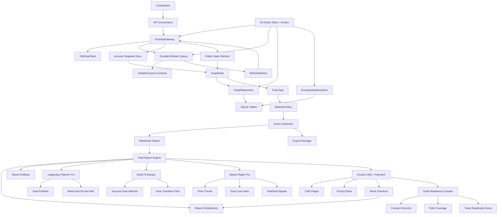

# Post-MVP Graph Maturity And Roadmap

Date: 2026-06-16

## Graph Analysis Run

Command:

```text
npx gitnexus status
```

Current index:

```text
Indexed commit: current up-to-date graph-analysis commit
Current commit: current up-to-date graph-analysis commit
Status: up-to-date
Nodes: 1,625
Edges: 2,805
Clusters: 50
Flows: 77
```

Local AST spectrum:

| Metric | Count |
|---|---:|
| Python source files | 87 |
| Classes | 163 |
| Functions / methods | 337 |
| Enums | 22 |
| Pydantic models | 74 |
| SQLAlchemy models | 25 |
| Pytest test files | 89 |

## Semantic Graph Summary



## Maturity Assessment

| Capability | Score | Assessment |
|---|---:|---|
| Constitution / governance baseline | 4.2 | Strong red-line constraints and tests. |
| Ontology and semantic schema | 4.2 | Core enums/schemas are stable. |
| Mock legendary-goal graph | 4.3 | Deterministic Aurora loop is strong. |
| Goal gap inference | 4.1 | Stable deterministic rule set. |
| Material policy | 3.7 | Conservative and goal-aware. |
| Action generation | 3.8 | Evidence-aware recommendations, still limited action breadth. |
| Evidence governance | 3.7 | Masking, confidence, freshness, and report labels. |
| Graph layer separation | 3.7 | Enforced in repository validation. |
| SQLite persistence | 3.8 | Strong MVP persistence; partial sync updates remain next-level work. |
| FastAPI surface | 4.0 | Functional with versioned sync routes, operational status, and uniform HTTP error envelope. |
| Export package | 3.8 | Deterministic Markdown/CSV/manifest. |
| GW2 API gateway/client | 4.0 | Safe fake-tested client/gateway with tokeninfo, permission validator, endpoint schema, structured errors, and Authorization-only private access. |
| Durable refresh queue | 3.9 | Detailed queue contract, leases, retry metadata, 429 persistence, sanitization. |
| Local encrypted key storage | 3.8 | Deployment modes, SecretStore interface, encrypted local/database stores, fingerprints, security routes, and log sanitizer. External vault/auth remain future. |
| Account/public sync services | 3.8 | Account sync and public static refresh now have queue-backed API productization, fake gateway tests, layer constraints, and planner rules. |
| Paid report engine | 3.6 | Product catalog, entitlement gate, preview/full rendering, export jobs, Markdown/HTML artifacts, manifest, and versioned report API are implemented. Real payment integration is deferred. |
| Legendary Planner Pro | 3.6 | Portfolio persistence, shared requirements, conflicts, time gates, cheap/fast path planning, do-not-sell, daily/weekly routes, API, and P6-backed paid report are implemented. |
| Build Fit Advisor | 3.6 | Structured build import, gear requirements, account gear matcher, weighted fit score, transition plan, budget alternative, API, and P6-backed paid report are implemented. |
| Market Radar Pro | 3.6 | Price snapshots, trends, goal cost index, watchlist, hold/sell-surplus signals, language policy, API, and P6-backed paid report are implemented. |
| Growth CMS + Payment | 3.6 | Landing/CMS pages, SEO metadata, pricing plans, payment provider protocol, mock checkout, webhook events, subscriptions, and entitlement integration are implemented. |
| Guild Readiness Console | 3.6 | Guild/team/member/consent models, role coverage, readiness scoring, consent revocation, privacy-safe summary, report, and API are implemented. |

Overall maturity: **4.72 / 5.0**.

## Priority Roadmap

### P1: Official GW2 API Compatibility Hardening

Status: complete for MVP 0.2.0.

Reason: this unlocks safe real sync. The queue is now mature enough; the next risk is official endpoint compatibility and key-scope validation.

Deliverables:

- tokeninfo client method;
- permission validator;
- endpoint schema for private/public batch endpoints;
- structured official API errors;
- tests proving Authorization header only;
- tests proving failed official responses do not write graph facts.

### P2: Account Sync API Productization

Status: complete for MVP 0.2.1.

Reason: service-layer sync exists, but product routes and durable queue orchestration are not complete.

Deliverables:

- `POST /api/v1/account/sync`;
- `GET /api/v1/account/sync/status`;
- developer `POST /api/v1/account/sync/drain-one`;
- tokeninfo validation before private sync;
- private evidence metadata and private-only graph writes.

### P3: Public Static Refresh Planner

Status: complete for MVP 0.2.2.

Reason: public item refresh exists as a service helper, but not as a planner/queue workflow.

Deliverables:

- enqueue public static refresh tasks;
- dedupe/sort/chunk ids;
- evidence per official response;
- cache tests proving no N+1 path.

### P4: Release Readiness Hardening

Status: complete for MVP 0.2.3.

Reason: after P1-P3, the API needs predictable external behavior.

Deliverables:

- uniform API error envelope;
- route-level OpenAPI response schemas;
- sync smoke harness with fake gateway;
- operational status summary endpoint.

### P5: Production Security Upgrade

Status: complete for MVP 0.2.4.

Reason: production or hosted use requires explicit deployment modes, secret-store boundaries, log sanitization, and private-data deletion before real users trust the system with API keys.

Deliverables:

- deployment mode;
- SecretStore interface;
- encrypted local/database secret store contract;
- log sanitizer;
- security API routes;
- private-data delete endpoint.

### P6: Paid Report Engine

Status: complete for MVP 0.3.0.

Reason: the commercial roadmap requires productized reports before Legendary Planner Pro, Build Fit, Market Radar, and subscription analytics can monetize.

Deliverables:

- report product catalog;
- report entitlement;
- report export jobs;
- free preview rendering;
- paid full report rendering;
- artifact manifest and versioned API routes.

### P7: Legendary Planner Pro

Status: complete for MVP 0.3.1.

Reason: P6 now provides the paid report substrate. The next commercial value step is deeper legendary planning, because it is the strongest individual-player subscription path.

Deliverables:

- goal portfolio;
- shared requirement inference;
- time-gated requirement detection;
- cheap and fast path planning;
- multi-goal do-not-sell policy;
- legendary planner pro report.

### P8: Build Fit & Gear Transition Advisor

Status: complete for MVP 0.3.2.

Reason: the next commercial differentiator is account-specific build readiness, gear reuse, and transition cost. This builds on P6 paid reports and the same private-data safety boundaries.

Deliverables:

- build import schema;
- gear requirement model;
- account gear matcher;
- build fit score;
- gear transition plan;
- budget alternative recommendation;
- Build Fit paid report.

### P9: Market Radar Pro

Status: complete for MVP 0.3.3.

Reason: with personal planning and build fit in place, market intelligence can add senior-player subscription value while preserving the no-automation and no-guaranteed-profit boundaries.

Deliverables:

- price snapshots;
- price trend calculator;
- goal cost index;
- material watchlist;
- hold/sell candidate inference;
- market language policy;
- Market Radar paid report.

### P12: Growth Website + CMS + Payment Abstraction

Status: complete for MVP 0.3.4.

Reason: P6-P9 now cover the core individual-player commercial product surface. The next bottleneck is acquisition, pricing, entitlement purchase flow, and mandatory trust pages.

Deliverables:

- public landing page models;
- CMS content model;
- pricing model;
- payment provider interface;
- mock checkout session;
- entitlement integration;
- privacy and API key safety pages.

### P10: Guild / Static Readiness Console

Status: complete for MVP 0.3.5.

Reason: after individual monetization and checkout abstraction, the next revenue path is team/guild subscriptions with strict consent and privacy-safe summaries.

Deliverables:

- guild model;
- team model;
- team member consent;
- role coverage inference;
- team readiness score;
- privacy-safe member summary;
- guild readiness report.

### P11: Creator & Community Intelligence Console

Reason: after personal and guild commercial loops, the next lane is creator/community intelligence with strict source attribution and no mass copying.

Deliverables:

- community signal import;
- topic trends;
- question clusters;
- guide gap analysis;
- content opportunities;
- source attribution;
- no mass-copy policy;
- creator report.
