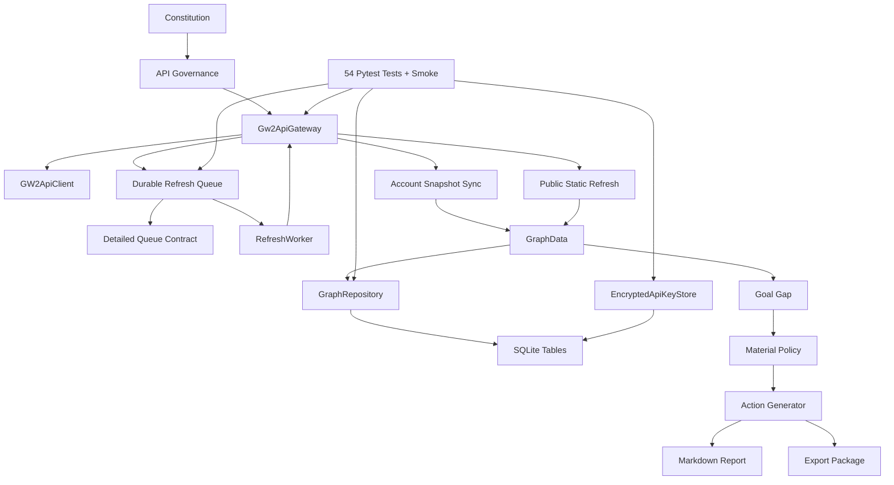

# Post-MVP Graph Maturity And Roadmap

Date: 2026-06-16

## Graph Analysis Run

Command:

```text
npx gitnexus status
```

Current index:

```text
Indexed commit: current up-to-date graph-analysis commit
Current commit: current up-to-date graph-analysis commit
Status: up-to-date
Nodes: 1,625
Edges: 2,805
Clusters: 50
Flows: 77
```

Local AST spectrum:

| Metric | Count |
|---|---:|
| Python source files | 57 |
| Classes | 55 |
| Functions / methods | 158 |
| Enums | 8 |
| Pydantic models | 12 |
| SQLAlchemy models | 7 |
| Pytest tests | 54 |

## Semantic Graph Summary



## Maturity Assessment

| Capability | Score | Assessment |
|---|---:|---|
| Constitution / governance baseline | 4.2 | Strong red-line constraints and tests. |
| Ontology and semantic schema | 4.2 | Core enums/schemas are stable. |
| Mock legendary-goal graph | 4.3 | Deterministic Aurora loop is strong. |
| Goal gap inference | 4.1 | Stable deterministic rule set. |
| Material policy | 3.7 | Conservative and goal-aware. |
| Action generation | 3.8 | Evidence-aware recommendations, still limited action breadth. |
| Evidence governance | 3.7 | Masking, confidence, freshness, and report labels. |
| Graph layer separation | 3.7 | Enforced in repository validation. |
| SQLite persistence | 3.8 | Strong MVP persistence; partial sync updates remain next-level work. |
| FastAPI surface | 4.0 | Functional with versioned sync routes, operational status, and uniform HTTP error envelope. |
| Export package | 3.8 | Deterministic Markdown/CSV/manifest. |
| GW2 API gateway/client | 4.0 | Safe fake-tested client/gateway with tokeninfo, permission validator, endpoint schema, structured errors, and Authorization-only private access. |
| Durable refresh queue | 3.9 | Detailed queue contract, leases, retry metadata, 429 persistence, sanitization. |
| Local encrypted key storage | 3.8 | Deployment modes, SecretStore interface, encrypted local/database stores, fingerprints, security routes, and log sanitizer. External vault/auth remain future. |
| Account/public sync services | 3.8 | Account sync and public static refresh now have queue-backed API productization, fake gateway tests, layer constraints, and planner rules. |

Overall maturity: **4.42 / 5.0**.

## Priority Roadmap

### P1: Official GW2 API Compatibility Hardening

Status: complete for MVP 0.2.0.

Reason: this unlocks safe real sync. The queue is now mature enough; the next risk is official endpoint compatibility and key-scope validation.

Deliverables:

- tokeninfo client method;
- permission validator;
- endpoint schema for private/public batch endpoints;
- structured official API errors;
- tests proving Authorization header only;
- tests proving failed official responses do not write graph facts.

### P2: Account Sync API Productization

Status: complete for MVP 0.2.1.

Reason: service-layer sync exists, but product routes and durable queue orchestration are not complete.

Deliverables:

- `POST /api/v1/account/sync`;
- `GET /api/v1/account/sync/status`;
- developer `POST /api/v1/account/sync/drain-one`;
- tokeninfo validation before private sync;
- private evidence metadata and private-only graph writes.

### P3: Public Static Refresh Planner

Status: complete for MVP 0.2.2.

Reason: public item refresh exists as a service helper, but not as a planner/queue workflow.

Deliverables:

- enqueue public static refresh tasks;
- dedupe/sort/chunk ids;
- evidence per official response;
- cache tests proving no N+1 path.

### P4: Release Readiness Hardening

Status: complete for MVP 0.2.3.

Reason: after P1-P3, the API needs predictable external behavior.

Deliverables:

- uniform API error envelope;
- route-level OpenAPI response schemas;
- sync smoke harness with fake gateway;
- operational status summary endpoint.

### P5: Production Security Upgrade

Status: complete for MVP 0.2.4.

Reason: production or hosted use requires explicit deployment modes, secret-store boundaries, log sanitization, and private-data deletion before real users trust the system with API keys.

Deliverables:

- deployment mode;
- SecretStore interface;
- encrypted local/database secret store contract;
- log sanitizer;
- security API routes;
- private-data delete endpoint.

### P6: Returner Diagnosis

Reason: this should build on stable account snapshots rather than mock-only assumptions.

Deliverables:

- returner readiness score;
- missing unlock inference;
- 7-day and 30-day plans;
- evidence-labeled returner report.
