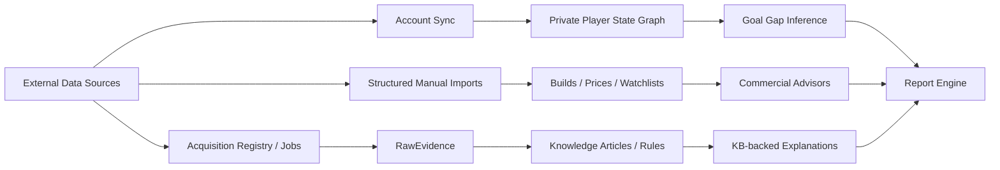
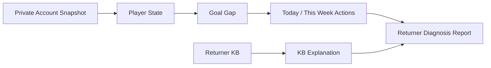
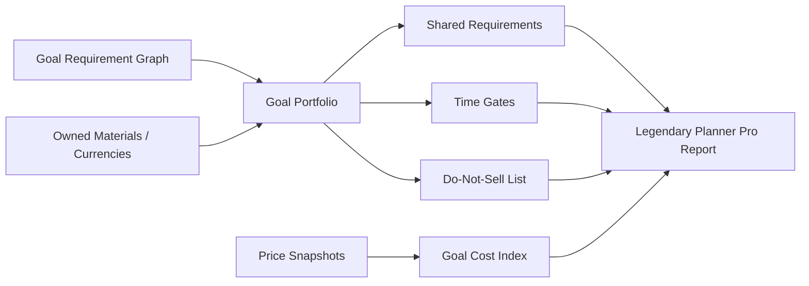
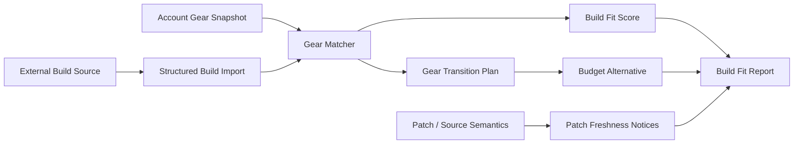

# GW2Radar Three Commercial Opportunities User Guide

## Purpose

This guide explains how users and operators use the three core GW2Radar commercial opportunities after external data is imported into the system.

The guide is based on the current code graph and semantic graph:

- Code graph: `npx gitnexus status` reports the repository index is up to date at commit `2f743b3`.
- Semantic graph: the implemented ontology centers on `Knowledge Base -> Knowledge Graph -> Player State -> Action Engine -> Report Engine`.
- Commercial scope: Returner Account Diagnosis, Legendary Goal Planning, and Build / Gear Transition Fit.

## System Map



## Shared Data Import Workflow

Use this foundation before running any commercial workflow.

1. Load local mock graph for development.

```http
POST /mock/load
```

2. Register or import external knowledge sources.

```http
GET  /api/v1/acquisition/seed-packs
POST /api/v1/acquisition/seed-packs/mvp_baseline/import
POST /api/v1/acquisition/local-pdf/import
POST /api/v1/acquisition/manual-note/import
POST /api/v1/acquisition/web-summary/import
```

3. Review source and evidence maturity.

```http
GET /api/v1/acquisition/evidence-coverage
GET /api/v1/acquisition/promotion-workflow
GET /api/v1/acquisition/promotion-action-plans
GET /api/v1/acquisition/promotion-release-manifest
GET /api/v1/acquisition/final-maturity-rollup
```

4. Load or review KB content.

```http
POST /api/v1/kb/load-directory
GET  /api/v1/kb/semantic-maturity
GET  /api/v1/kb/release-readiness
GET  /api/v1/kb/promotion-plan
```

5. Import private account state, when using real account data.

```http
PUT  /api/v1/account/api-key
POST /api/v1/account/sync
POST /api/v1/account/sync/drain-one
GET  /api/v1/account/sync/status
```

The account sync coordinator validates GW2 API permissions before queueing private endpoints. It syncs `/v2/account`, `/v2/characters`, wallet, materials, bank, and achievements into the private player state graph. API keys are stored through the encrypted key store and must not be placed in source code.

## Opportunity 1: Returner Account Diagnosis

### User Question

> I have not played GW2 for a long time. What should I do first?

### Code Graph Anchors

- API: `src/gw2radar/api/routes/goals.py`
- API: `src/gw2radar/api/routes/actions.py`
- API: `src/gw2radar/api/routes/reports.py`
- Inference: `src/gw2radar/inference/goal_gap.py`
- Inference: `src/gw2radar/inference/action_generator.py`
- Reports: `src/gw2radar/reports/markdown_report.py`

### Semantic Graph



### External Data Needed

- Private GW2 API account snapshot.
- Returner KB articles under `docs/knowledge_base/returner/`.
- Optional official patch/news summaries for freshness context.

### User Flow

1. Import or sync account data.

```http
PUT  /api/v1/account/api-key
POST /api/v1/account/sync
POST /api/v1/account/sync/drain-one
```

2. Inspect available goals and current gap.

```http
GET /goals
GET /goals/gw2:goal:aurora/gap
```

3. Generate recommended actions.

```http
POST /goals/gw2:goal:aurora/actions/generate
```

4. Generate free preview or full report.

```http
POST /api/v1/reports/preview
POST /api/v1/reports/generate
GET  /api/v1/reports/jobs/{job_id}
```

Use `product_id=returner_preview_free` for preview. Full paid products require entitlement.

### Output To User

- Account summary.
- Active goal progress.
- Missing requirements.
- Recommended actions today and this week.
- Evidence confidence notes.
- KB-backed explanations if reviewed and enabled KB rules exist.

### Boundaries

- Recommendations are informational only.
- No gameplay automation.
- No invented facts about the account.
- Private account data must stay in private player state and report artifacts.

## Opportunity 2: Legendary Goal Planning

### User Question

> I want to craft a legendary. What am I missing, what should I do today, and which materials must I not sell?

### Code Graph Anchors

- API: `src/gw2radar/api/routes/legendary.py`
- Planner: `src/gw2radar/commercial/legendary_planner.py`
- Market extension: `src/gw2radar/api/routes/market.py`
- Report engine: `src/gw2radar/commercial/report_engine.py`

### Semantic Graph



### External Data Needed

- Private account materials, wallet, bank, achievements.
- Legendary KB under `docs/knowledge_base/legendary/`.
- Optional market snapshots for add-on cost context.
- Official API/public static data and PDF/news summaries for evidence.

### User Flow

1. Sync account state.

```http
PUT  /api/v1/account/api-key
POST /api/v1/account/sync
POST /api/v1/account/sync/drain-one
```

2. Create or update legendary portfolio.

```http
POST /api/v1/legendary/goals
GET  /api/v1/legendary/portfolio
POST /api/v1/legendary/recompute
```

Example goal payload:

```json
{
  "graph_goal_id": "gw2:goal:aurora",
  "priority": 100
}
```

3. Review do-not-sell guidance.

```http
GET /api/v1/legendary/do-not-sell
```

4. Optionally import market data for price context.

```http
POST /api/v1/market/snapshots
POST /api/v1/market/watchlist
GET  /api/v1/market/goal-cost-index?goal_id=gw2:goal:aurora
GET  /api/v1/market/signals?goal_id=gw2:goal:aurora
```

5. Generate paid Legendary Planner Pro report.

```http
POST /api/v1/legendary/report
GET  /api/v1/reports/jobs/{job_id}
```

### Output To User

- Active legendary portfolio.
- Shared material conflicts.
- Time-gated requirements.
- Daily and weekly manual route suggestions.
- Cheap path and fast path.
- Do-not-sell material reservations.
- Evidence refs and safety notes.

### Boundaries

- The system never crafts, buys, sells, or automates gameplay.
- Market guidance is planning support only.
- Do-not-sell is a reservation policy, not account mutation.
- Report generation requires entitlement for paid products.

## Opportunity 3: Build / Gear Transition Fit

### User Question

> Can my account play this build now, what am I missing, and how much will it cost to switch?

### Code Graph Anchors

- API: `src/gw2radar/api/routes/builds.py`
- Advisor: `src/gw2radar/commercial/build_fit.py`
- Patch freshness: `src/gw2radar/commercial/patch_freshness.py`
- KB policy: `docs/knowledge_base/source_registry/build_sources.md`

### Semantic Graph



### External Data Needed

- Structured build data entered by user/operator.
- Account gear snapshot.
- Optional build source URL and attribution.
- Build KB under `docs/knowledge_base/build/`.
- Patch summaries and source semantics for freshness notices.

### User Flow

1. Import a structured build.

```http
POST /api/v1/builds/import
```

Example payload:

```json
{
  "name": "Open World Power Reaper",
  "source": {
    "name": "manual_import",
    "url": "https://example.invalid/build",
    "attribution": "User-provided structured build data."
  },
  "profession": "Necromancer",
  "specialization": "Reaper",
  "role": "open_world_dps",
  "game_mode": "open_world",
  "patch_version": "manual-review",
  "patch_freshness_days": 20,
  "difficulty": "low",
  "estimated_transition_cost_gold": 45,
  "requirements": [
    {
      "slot": "chest",
      "item_name": "Berserker Chest",
      "stat_combo": "Berserker",
      "required": true,
      "estimated_cost_gold": 8
    }
  ]
}
```

2. List builds and choose a build id.

```http
GET /api/v1/builds
```

3. Evaluate build fit with account gear.

```http
POST /api/v1/builds/fit
```

Example payload:

```json
{
  "build_id": "build_id_from_import",
  "account_gear": {
    "profession": "Necromancer",
    "specializations": ["Reaper"],
    "preferred_game_modes": ["open_world"],
    "difficulty_preference": "medium",
    "wallet_gold": 100,
    "gear": [
      {
        "slot": "chest",
        "item_name": "Existing Berserker Chest",
        "stat_combo": "Berserker"
      }
    ]
  }
}
```

4. Generate transition plan and budget alternative.

```http
POST /api/v1/builds/transition-plan
```

5. Generate paid Build Fit report.

```http
POST /api/v1/builds/report
GET  /api/v1/reports/jobs/{job_id}
```

### Output To User

- Fit score.
- Playable-now flag.
- Gear reuse and missing gear.
- Manual transition steps.
- Estimated transition cost.
- Budget alternative.
- Source attribution and patch freshness warning.

### Boundaries

- No automatic gear change.
- Build source attribution must be preserved.
- Imported build data must be structured summaries, not copied full guides.
- Patch freshness is a review warning, not a performance guarantee.

## External Data Import Reference

| Data Type | Import Path | Used By | Notes |
|---|---|---|---|
| GW2 API key | `PUT /api/v1/account/api-key` | Returner, Legendary, Build Fit | Stored encrypted; never commit secrets. |
| Account snapshot | `/api/v1/account/sync` + `/drain-one` | Returner, Legendary, Build Fit | Validates private endpoint permissions. |
| Official/public sources | `/api/v1/acquisition/seed-packs/{id}/import` | KB, reports, release gates | Use source policies and review gates. |
| Local PDFs | `POST /api/v1/acquisition/local-pdf/import` | KB, patch freshness, explanations | Summary/reference only; no full-text copying. |
| Manual notes | `POST /api/v1/acquisition/manual-note/import` | KB, patch review, source evidence | Good for operator-curated summaries. |
| Web summaries | `POST /api/v1/acquisition/web-summary/import` | KB and source semantics | Must include attribution and safe summary. |
| KB Markdown | `POST /api/v1/kb/load-directory` | Explanations and release readiness | Review before rule distillation. |
| Build import | `POST /api/v1/builds/import` | Build Fit | Structured build requirements only. |
| Price snapshots | `POST /api/v1/market/snapshots` | Legendary add-on, Market Radar | Manual planning data; no automated trading. |
| Watchlist | `POST /api/v1/market/watchlist` | Market Radar and patch freshness | Observation only. |

## Operator Readiness Checklist

Before offering any paid report:

```http
GET /api/v1/kb/release-readiness
GET /api/v1/acquisition/final-maturity-rollup
GET /api/v1/acquisition/promotion-release-manifest
GET /api/v1/reports/products
```

Required checks:

- KB rules used in explanations are reviewed and enabled.
- Promotion queues have no unresolved blockers for the intended source set.
- Reports preserve assumptions and evidence refs.
- No private data is exposed in public KB or public source artifacts.
- No report promises outcomes, automates gameplay, or automates trading.

## Product Summary

| Opportunity | Main User Value | Primary Inputs | Main Outputs |
|---|---|---|---|
| Returner Account Diagnosis | Reduce comeback confusion | Account snapshot, returner KB, goal graph | What to do first, today/week actions, evidence-backed report |
| Legendary Goal Planning | Reduce long-term legendary planning cost | Goal graph, account materials, legendary KB, optional prices | Missing requirements, do-not-sell, cheap/fast paths, report |
| Build / Gear Transition Fit | Reduce build selection and conversion cost | Structured build, account gear, build KB, patch freshness | Fit score, reusable/missing gear, transition cost, budget alternative |

