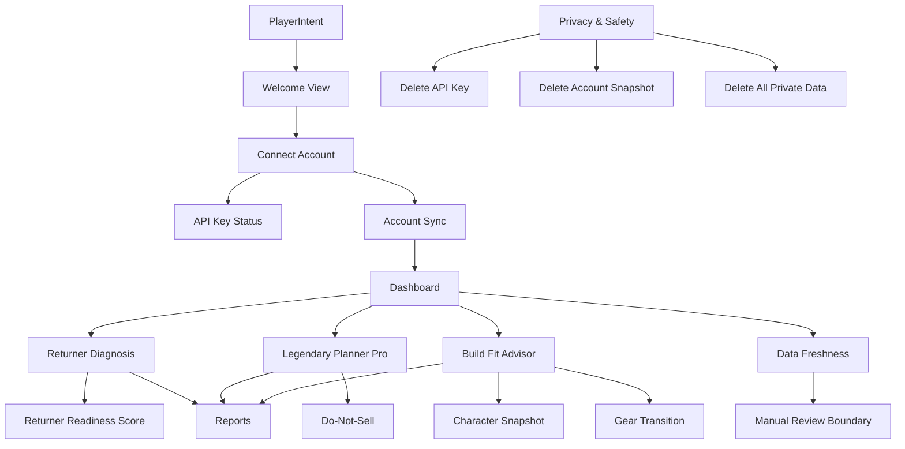

# Player UI Semantic Graph Audit

## Scope

This audit compares the implemented player UI against `GW2Radar_Player_UI_Guide_Three_Commercial_Opportunities.md`.

## Semantic Graph

## Ontology Classes

| Class | UI Anchor | Backend Anchor | Maturity |
| --- | --- | --- | --- |
| PlayerIntent | Welcome intent buttons | Browser local UI state | Implemented |
| AccountConnection | Connect key form and key status | `/account/api-key`, `/api/v1/security/api-key/status` | Implemented |
| AccountSync | Sync controls and checklist | `/api/v1/account/sync` | Implemented |
| DashboardAction | Today actions and opportunity cards | Static UI plus existing goal/build/market APIs | Partial |
| ReturnerDiagnosis | Returner view | `/goals`, `/goals/{goal_id}/gap`, actions, preview | Implemented |
| ReturnerReadiness | Returner score cards | `/api/v1/returner/readiness` | Implemented |
| LegendaryPlanning | Legendary view | `/api/v1/legendary/*`, `/api/v1/market/*` | Implemented |
| BuildFit | Build Fit view | `/api/v1/builds/*` | Implemented |
| CharacterSnapshot | Build Fit character snapshot selector | `/api/v1/builds/character-snapshots` | Implemented |
| ReportArtifact | Reports view | `/api/v1/reports/*`, local report history | Implemented |
| FreshnessSignal | Freshness view and dashboard card | Sync status, market patch freshness, build freshness | Partial |
| PrivacyControl | Privacy view | `/account/*`, `/api/v1/security/private-data` | Implemented |

## Guide Checklist

| Guide Requirement | Implementation | Completeness |
| --- | --- | --- |
| P0 Welcome page | `Welcome` view with player intent choices | Complete |
| P0 API key connect page | `Connect` view with key form and safety notes | Complete |
| P0 Permission check page | Required/optional permission chips and key status action | Partial; backend does not expose granular permission list in this UI |
| P0 Account sync progress | Sync controls and progress checklist | Partial; checklist is state-level, not per-endpoint progress |
| P0 Dashboard | Account status, actions, opportunity cards, do-not-sell warning | Complete |
| P1 Returner onboarding questions | Last played and interest controls | Complete |
| P1 Account readiness score | Travel, combat, progression, legendary, and group PvE score cards | Complete |
| P1 What to do first | Today actions and generated action plan | Partial |
| P1 7-day recovery plan | `7-day action plan` action | Complete |
| P1 Report preview | `Generate preview` action | Complete |
| P2 Goal selection | Aurora goal select | Partial; more goal types remain future work |
| P2 Portfolio view | Load portfolio action | Complete |
| P2 Missing requirements | Goal gap and recompute output | Complete |
| P2 Do-not-sell list | Do-not-sell action and dashboard warning | Complete |
| P2 Today / this week actions | Today actions present; this-week plan not modeled separately | Partial |
| P2 Route comparison | Cheap/fast path action | Complete |
| P3 Build import | Manual structured build import | Complete |
| P3 Character selection | Manual sample character snapshots plus manual fields mode | Complete |
| P3 Fit score | Fit score action | Complete |
| P3 Gear reuse / missing gear | Fit and transition plan output | Complete |
| P3 Transition cost | Transition plan output | Complete |
| P3 Budget alternative | Transition plan output | Complete |
| P3 Patch freshness warning | Patch freshness action | Complete |
| P4 Free preview | Returner report preview | Complete |
| P4 Full report generation | Legendary and build report generation | Partial; returner full report remains product-driven |
| P4 Previous reports | Local report history | Complete |
| P4 Download/export | Artifact open action | Complete |
| P4 Data freshness annotations | Freshness view and summaries | Partial |
| P5 API key safety page | Privacy page and connect notes | Complete |
| P5 Delete API key | Delete key action | Complete |
| P5 Delete account snapshot | Delete snapshot action | Complete |
| P5 Delete private data | Delete all private data action | Complete |
| P5 Explain data usage | Privacy boundaries | Complete |

## Maturity Summary

- Complete: 25 guide items.
- Partial: 7 guide items.
- Missing: 0 guide items.

The largest remaining semantic gaps are now depth gaps rather than missing workflow nodes: granular permission inspection, per-endpoint sync progress, broader legendary goal selection, and replacing manual sample character snapshots with synced official character equipment when that private data path is available.
