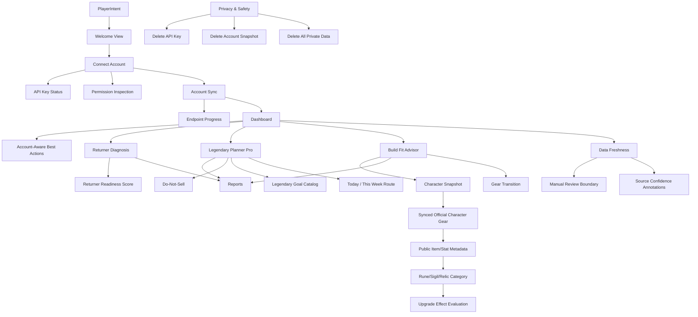

# Player UI Semantic Graph Audit

## Scope

This audit compares the implemented player UI against `GW2Radar_Player_UI_Guide_Three_Commercial_Opportunities.md`.

## Semantic Graph

## Ontology Classes

| Class | UI Anchor | Backend Anchor | Maturity |
| --- | --- | --- | --- |
| PlayerIntent | Welcome intent buttons | Browser local UI state | Implemented |
| AccountConnection | Connect key form and key status | `/account/api-key`, `/api/v1/security/api-key/status` | Implemented |
| PermissionInspection | Connect permission status grid | `/account/api-key/permissions` | Implemented |
| AccountSync | Sync controls and endpoint checklist | `/api/v1/account/sync` endpoint progress | Implemented |
| DashboardAction | Today and this-week account-aware actions | `/api/v1/player/dashboard` | Implemented |
| ReturnerDiagnosis | Returner view | `/goals`, `/goals/{goal_id}/gap`, actions, preview | Implemented |
| ReturnerReadiness | Returner score cards | `/api/v1/returner/readiness` | Implemented |
| LegendaryPlanning | Legendary view | `/api/v1/legendary/*`, `/api/v1/market/*` | Implemented |
| LegendaryGoalCatalog | Goal select with seven player-guide choices | `/api/v1/legendary/goals/catalog` | Implemented |
| LegendaryWeeklyRoute | Today and this-week route comparison | `/api/v1/legendary/actions` | Implemented |
| BuildFit | Build Fit view | `/api/v1/builds/*` | Implemented |
| CharacterSnapshot | Build Fit character snapshot selector with synced-first/manual fallback sources | `/api/v1/builds/character-snapshots` | Implemented |
| SyncedCharacterGear | Official API-derived character equipment snapshot | Account sync private character detail bridge | Implemented |
| PublicItemMetadata | Public item and stat-name enrichment for synced equipment | `/v2/items`, `/v2/itemstats` best-effort batch metadata | Implemented |
| GearSemanticCategory | Rune, sigil, relic, armor, and weapon category labels for Build Fit gear | Official item metadata, equipment upgrades, and Build Fit account gear snapshots | Implemented |
| UpgradeEffectEvaluation | Conservative rune, sigil, and relic effect-family review hints | Build Fit result `upgrade_effects` and Build Fit report Upgrade Effects section | Implemented |
| ReportArtifact | Reports view | `/api/v1/reports/*`, local report history | Implemented |
| FreshnessSignal | Freshness view, dashboard card, and source confidence annotations | `/api/v1/player/freshness-annotations` plus report artifacts | Implemented |
| PrivacyControl | Privacy view | `/account/*`, `/api/v1/security/private-data` | Implemented |

## Guide Checklist

| Guide Requirement | Implementation | Completeness |
| --- | --- | --- |
| P0 Welcome page | `Welcome` view with player intent choices | Complete |
| P0 API key connect page | `Connect` view with key form and safety notes | Complete |
| P0 Permission check page | Required/optional chips, permission inspection action, granted/missing status, and limited-mode feature impacts | Complete |
| P0 Account sync progress | Sync controls and endpoint-level progress for account, characters, wallet, materials, bank, and achievements | Complete |
| P0 Dashboard | Account status, actions, opportunity cards, do-not-sell warning | Complete |
| P1 Returner onboarding questions | Last played and interest controls | Complete |
| P1 Account readiness score | Travel, combat, progression, legendary, and group PvE score cards | Complete |
| P1 What to do first | Account-aware dashboard best actions plus generated action plan | Complete |
| P1 7-day recovery plan | `7-day action plan` action | Complete |
| P1 Report preview | `Generate preview` action | Complete |
| P2 Goal selection | Aurora, Vision, Conflux, Ad Infinitum, Legendary Weapon, Legendary Armor, and Custom Goal catalog | Complete |
| P2 Portfolio view | Load portfolio action | Complete |
| P2 Missing requirements | Goal gap and recompute output | Complete |
| P2 Do-not-sell list | Do-not-sell action and dashboard warning | Complete |
| P2 Today / this week actions | Legendary action plan exposes today actions, this-week actions, and route comparison | Complete |
| P2 Route comparison | Cheap/fast path action | Complete |
| P3 Build import | Manual structured build import | Complete |
| P3 Character selection | Synced official API character snapshots, manual samples, and manual fields mode | Complete |
| P3 Fit score | Fit score action | Complete |
| P3 Gear reuse / missing gear | Fit and transition plan output | Complete |
| P3 Transition cost | Transition plan output | Complete |
| P3 Budget alternative | Transition plan output | Complete |
| P3 Patch freshness warning | Patch freshness action | Complete |
| P4 Free preview | Returner report preview | Complete |
| P4 Full report generation | Returner, Legendary, and Build full report generation through entitlement-gated artifacts | Complete |
| P4 Previous reports | Local report history | Complete |
| P4 Download/export | Artifact open action | Complete |
| P4 Data freshness annotations | Recommendation-level source confidence appears in dashboard, freshness view, preview, and full reports | Complete |
| P5 API key safety page | Privacy page and connect notes | Complete |
| P5 Delete API key | Delete key action | Complete |
| P5 Delete account snapshot | Delete snapshot action | Complete |
| P5 Delete private data | Delete all private data action | Complete |
| P5 Explain data usage | Privacy boundaries | Complete |

## Maturity Summary

- Complete: 32 guide items.
- Partial: 0 guide items.
- Missing: 0 guide items.

All player-guide checklist items are now implemented at MVP depth. Synced character equipment now bridges official character detail into Build Fit, enriches item/stat names through best-effort public item metadata, classifies armor, weapons, runes, sigils, and relics, and adds conservative upgrade effect-family review hints without inventing missing facts. Remaining post-MVP depth improvements are qualitative rather than checklist gaps: more domain-specific requirements for every seeded legendary goal, richer effect parsing from official descriptions/KB rules, and front-end polish for long-running sync worker timelines.
