# Player UI Semantic Graph Audit

## Scope

This audit compares the implemented player UI against `GW2Radar_Player_UI_Guide_Three_Commercial_Opportunities.md`.

## Semantic Graph

```mermaid
graph TD
  PlayerIntent["PlayerIntent"] --> Welcome["Welcome View"]
  Welcome --> Connect["Connect Account"]
  Connect --> AccountKey["API Key Status"]
  Connect --> PermissionInspection["Permission Inspection"]
  Connect --> AccountConnectionDiagnostic["Account Connection Diagnostic"]
  AccountConnectionDiagnostic --> DiagnosticFixAction["Diagnostic Fix Action"]
  AccountConnectionDiagnostic --> AccountDebugBundle["Privacy-Safe Debug Bundle"]
  AccountDebugBundle --> AccountDebugBundleReview["Support Review Parser"]
  AccountDebugBundleReview --> SupportReviewWorkbench["Support Review Workbench"]
  SupportReviewWorkbench --> SupportReviewAudit["Support Review Audit Log"]
  SupportReviewAudit --> SupportReviewAuditExport["Filtered CSV Export"]
  SupportReviewAudit --> SupportReviewMetrics["Metrics Summary"]
  SupportReviewMetrics --> SupportReviewPlaybook["Remediation Playbook"]
  SupportReviewPlaybook --> SupportReviewBacklog["Product Fix Backlog"]
  SupportReviewBacklog --> SupportReviewBacklogExport["Backlog Markdown/CSV Export"]
  SupportReviewBacklog --> SupportBacklogPromotion["Roadmap Draft Promotion"]
  SupportBacklogPromotion --> SupportBacklogPromotionExport["Promotion Markdown/CSV Export"]
  SupportBacklogPromotion --> SupportBacklogPromotionEvent["Promotion Status Event"]
  SupportBacklogPromotionEvent --> SupportPromotionReadiness["Promotion Readiness Rollup"]
  Connect --> AccountSync["Account Sync"]
  PermissionInspection --> AccountConnectionDiagnostic
  AccountSync --> AccountConnectionDiagnostic
  AccountSync --> EndpointProgress["Endpoint Progress"]
  AccountSync --> Dashboard["Dashboard"]
  Dashboard --> BestActions["Account-Aware Best Actions"]
  Dashboard --> Returner["Returner Diagnosis"]
  Returner --> ReturnerReadiness["Returner Readiness Score"]
  Dashboard --> Legendary["Legendary Planner Pro"]
  Dashboard --> AchievementRoute["Achievement Route Planner"]
  AchievementRoute --> RouteSourceManifest["Reviewed Route Source Manifest"]
  AchievementRoute --> OfficialAchievementPreview["Official Achievement Draft Preview"]
  OfficialAchievementPreview --> OfficialAchievementFetch["Official Achievement Fetch Orchestration"]
  AchievementRoute --> RoutePrerequisite["Prerequisite State"]
  AchievementRoute --> RouteSegment["Map-Grouped Segment"]
  AchievementRoute --> RouteTimeGate["Daily/Weekly Time Gate"]
  AchievementRoute --> RouteExport["Markdown/CSV Route Export"]
  Dashboard --> BuildFit["Build Fit Advisor"]
  BuildFit --> CharacterSnapshot["Character Snapshot"]
  CharacterSnapshot --> SyncedCharacterGear["Synced Official Character Gear"]
  SyncedCharacterGear --> PublicItemMetadata["Public Item/Stat Metadata"]
  PublicItemMetadata --> GearSemanticCategory["Rune/Sigil/Relic Category"]
  GearSemanticCategory --> UpgradeEffectEvaluation["Upgrade Effect Evaluation"]
  BuildFit --> BuildUpgradeRulePack["build_upgrade_effects Rule Pack"]
  BuildUpgradeRulePack --> KBRule
  KBRule["Reviewed Enabled KB Rule"] --> UpgradeEffectEvaluation
  UpgradeEffectEvaluation --> PlayerUiE2ESmoke["Player UI E2E Smoke"]
  PlayerUiE2ESmoke --> ReportArtifact
  Dashboard --> Freshness["Data Freshness"]
  Returner --> ReportCenter["Reports"]
  Legendary --> ReportCenter
  BuildFit --> ReportCenter
  Legendary --> DoNotSell["Do-Not-Sell"]
  Legendary --> LegendaryGoalCatalog["Legendary Goal Catalog"]
  Legendary --> LegendaryWeeklyRoute["Today / This Week Route"]
  BuildFit --> GearTransition["Gear Transition"]
  Freshness --> SafetyBoundary["Manual Review Boundary"]
  Freshness --> SourceConfidence["Source Confidence Annotations"]
  Privacy["Privacy & Safety"] --> DeleteKey["Delete API Key"]
  Privacy --> DeleteSnapshot["Delete Account Snapshot"]
  Privacy --> DeleteAllPrivate["Delete All Private Data"]
```

## Ontology Classes

| Class | UI Anchor | Backend Anchor | Maturity |
| --- | --- | --- | --- |
| PlayerIntent | Welcome intent buttons | Browser local UI state | Implemented |
| AccountConnection | Connect key form and key status | `/account/api-key`, `/api/v1/security/api-key/status` | Implemented |
| PermissionInspection | Connect permission status grid | `/account/api-key/permissions` | Implemented |
| AccountConnectionDiagnostic | Connect read-only diagnostic PASS/WARN/FAIL cards with named missing scopes and fix actions | `/account/diagnostic`, `renderConnectionDiagnostic` | Implemented |
| DiagnosticFixAction | Player-facing fix buttons for key update, sync, drain-one, and snapshot load | `runDiagnosticFix`, diagnostic `fix_action_id` | Implemented |
| AccountDebugBundle | Exportable privacy-safe troubleshooting bundle | `/account/debug-bundle`, `debugBundleClientState`, `downloadJson` | Implemented |
| AccountDebugBundleReview | Local support review for exported bundles | `/account/debug-bundle/review`, `review_account_debug_bundle`, `harness/run_account_debug_bundle_review.py` | Implemented |
| SupportReviewWorkbench | Operator page for upload/paste review, findings, and reply template | `/support`, `/player-ui/support.js`, `harness/run_support_review_ui_smoke.py` | Implemented |
| SupportReviewAudit | Privacy-safe support case metadata audit | `/account/debug-bundle/review/audit`, `SupportReviewAuditModel`, `create_support_review_audit` | Implemented |
| SupportReviewAuditExport | Status/severity/reviewer filters and privacy-safe CSV export | `list_support_review_audits`, `render_support_review_audit_csv`, `/support` audit filters | Implemented |
| SupportReviewMetrics | Aggregated connection failure metrics from safe audit metadata | `/account/debug-bundle/review/audit/metrics`, `build_support_review_metrics`, `/support` metrics summary | Implemented |
| SupportReviewPlaybook | Top-blocker remediation steps, safe player templates, and product fix suggestions | `/account/debug-bundle/review/audit/playbook`, `build_support_review_playbook`, `/support` playbook section | Implemented |
| SupportReviewBacklog | Product backlog items ranked from playbook fix suggestions and affected support cases | `/account/debug-bundle/review/audit/backlog`, `build_support_review_product_backlog`, `/support` backlog section | Implemented |
| SupportReviewBacklogExport | Backlog export for roadmap and issue drafting | `/account/debug-bundle/review/audit/backlog?format=markdown`, `render_support_review_backlog_markdown`, `render_support_review_backlog_csv` | Implemented |
| SupportBacklogPromotion | Draft roadmap/issue artifact generated from a ranked support backlog item | `/account/debug-bundle/review/audit/backlog/promotions`, `create_support_backlog_promotion`, `/support` Roadmap Drafts section | Implemented |
| SupportBacklogPromotionExport | Promotion draft list and Markdown/CSV export | `list_support_backlog_promotions`, `render_support_backlog_promotions_markdown`, `render_support_backlog_promotions_csv` | Implemented |
| SupportBacklogPromotionEvent | Status lifecycle events for draft, accepted, linked, and closed promotion states | `/account/debug-bundle/review/audit/backlog/promotions/{promotion_id}/status`, `/account/debug-bundle/review/audit/backlog/promotions/events`, `update_support_backlog_promotion_status` | Implemented |
| SupportPromotionReadiness | Operator readiness gate that summarizes audits, backlog, promotions, events, blockers, warnings, and next steps | `/account/debug-bundle/review/audit/backlog/promotions/readiness`, `build_support_promotion_readiness_rollup`, `/support` Promotion Readiness section | Implemented |
| AccountSync | Sync controls and endpoint checklist | `/api/v1/account/sync` endpoint progress | Implemented |
| DashboardAction | Today and this-week account-aware actions | `/api/v1/player/dashboard` | Implemented |
| ReturnerDiagnosis | Returner view | `/goals`, `/goals/{goal_id}/gap`, actions, preview | Implemented |
| ReturnerReadiness | Returner score cards | `/api/v1/returner/readiness` | Implemented |
| LegendaryPlanning | Legendary view | `/api/v1/legendary/*`, `/api/v1/market/*` | Implemented |
| LegendaryGoalCatalog | Goal select with seven player-guide choices | `/api/v1/legendary/goals/catalog` | Implemented |
| LegendaryWeeklyRoute | Today and this-week route comparison | `/api/v1/legendary/actions` | Implemented |
| AchievementRoutePlanning | Routes view with goal, minutes, completed steps, prerequisites, and group-content opt-in | `/api/v1/achievement-routes/plan`, `build_achievement_route_plan` | Implemented |
| RouteSourceManifest | Reviewed achievement route source manifests with official source refs, reviewer, assumptions, and step count | `docs/knowledge_base/achievement_routes/*.json`, `/api/v1/achievement-routes/sources` | Implemented |
| OfficialAchievementPreview | Official achievement/account-achievement payloads converted into draft route source candidates with account progress and review warnings | `/api/v1/achievement-routes/official-preview`, `build_official_achievement_route_preview` | Implemented |
| OfficialAchievementFetch | Achievement id batch fetch through `/v2/achievements`, safe account progress merge, missing-id report, and draft preview export | `/api/v1/achievement-routes/official-fetch-preview`, `build_official_achievement_fetch_preview` | Implemented |
| OfficialAchievementReviewedPromotion | Manual reviewed gate that promotes a draft official fetch preview into a reviewed source manifest eligible for planner ingestion | `/api/v1/achievement-routes/official-fetch-preview/promote-reviewed`, `promote_official_fetch_preview_to_reviewed_manifest` | Implemented |
| AchievementRouteOperatorReviewUi | Routes view controls for official ids, reviewer, reviewed source id, review notes, fetch preview, reviewed promotion, and promoted-plan verification | `/player`, `fetchOfficialAchievementRoutePreview`, `promoteOfficialAchievementRouteReviewed`, `verifyPromotedAchievementRoute` | Implemented |
| AchievementRoutePromotionAudit | Metadata-only audit trail for reviewed promotion events with reviewer, source id, manifest path, achievement id evidence, and Markdown/CSV export | `/api/v1/achievement-routes/promotion-audit`, `record_achievement_route_promotion_audit`, `render_achievement_route_promotion_audit_csv` | Implemented |
| AchievementRouteReleaseReadiness | Release gate aggregating reviewed source coverage, audit coverage, missing official ids, blockers, warnings, next steps, and exports | `/api/v1/achievement-routes/release-readiness`, `build_achievement_route_release_readiness` | Implemented |
| AchievementRouteSourceQuality | Step-level quality review for evidence completeness, map inference risk, time-gate risk, missing official ids, score, and remediation | `/api/v1/achievement-routes/source-quality`, `build_achievement_route_source_quality_review` | Implemented |
| AchievementRouteRemediationQueue | Prioritized open reviewer tasks for official id backfill, evidence backfill, map review, and time-gate review | `/api/v1/achievement-routes/source-quality/remediation-queue`, `build_achievement_route_remediation_queue` | Implemented |
| AchievementRouteRemediationReviewAudit | Manual acknowledged/resolved/deferred remediation decisions with reviewer, notes, evidence refs, and metadata-only export | `/api/v1/achievement-routes/source-quality/remediation-queue/review`, `/review-audit`, `record_achievement_route_remediation_review` | Implemented |
| AchievementRouteRemediationReadiness | Go/no-go rollup for queue items plus review audit decisions, open P0/P1/P2 counts, blockers, warnings, and exports | `/api/v1/achievement-routes/source-quality/remediation-queue/readiness`, `build_achievement_route_remediation_readiness` | Implemented |
| RoutePrerequisiteState | Player-provided prerequisite ids separate ready from blocked route steps | `AchievementRouteRequest.unlocked_prerequisite_ids` | Implemented |
| RouteSegment | Map-grouped ready, blocked, and time-gated route segments | `AchievementRouteSegment` | Implemented |
| RouteExport | Deterministic Markdown/CSV route export with assumptions and manual boundary | `/api/v1/achievement-routes/plan/export`, `harness/run_achievement_route_smoke.py` | Implemented |
| BuildFit | Build Fit view | `/api/v1/builds/*` | Implemented |
| CharacterSnapshot | Build Fit character snapshot selector with synced-first/manual fallback sources | `/api/v1/builds/character-snapshots` | Implemented |
| SyncedCharacterGear | Official API-derived character equipment snapshot | Account sync private character detail bridge | Implemented |
| PublicItemMetadata | Public item and stat-name enrichment for synced equipment | `/v2/items`, `/v2/itemstats` best-effort batch metadata | Implemented |
| GearSemanticCategory | Rune, sigil, relic, armor, and weapon category labels for Build Fit gear | Official item metadata, equipment upgrades, and Build Fit account gear snapshots | Implemented |
| BuildUpgradeRulePack | Build Fit upgrade rule pack preview, import, list, and enable workflow | `/api/v1/kb/rule-packs/build_upgrade_effects`, `/api/v1/kb/rules` | Implemented |
| UpgradeEffectEvaluation | Conservative rune, sigil, and relic effect-family review hints with reviewed KB evidence when available | Build Fit result `upgrade_effects`, `KnowledgeRule`, and Build Fit report Upgrade Effects section | Implemented |
| PlayerUiE2ESmoke | Browserless regression of the player cockpit path | `harness/run_player_ui_e2e_smoke.py`, `tests/test_player_ui_e2e_smoke.py` | Implemented |
| ReportArtifact | Reports view | `/api/v1/reports/*`, local report history | Implemented |
| FreshnessSignal | Freshness view, dashboard card, and source confidence annotations | `/api/v1/player/freshness-annotations` plus report artifacts | Implemented |
| PrivacyControl | Privacy view | `/account/*`, `/api/v1/security/private-data` | Implemented |

## Guide Checklist

| Guide Requirement | Implementation | Completeness |
| --- | --- | --- |
| P0 Welcome page | `Welcome` view with player intent choices | Complete |
| P0 API key connect page | `Connect` view with key form and safety notes | Complete |
| P0 Permission check page | Required/optional chips, permission inspection action, granted/missing status, and limited-mode feature impacts | Complete |
| P0 Connection diagnostic | Read-only Connect diagnostic for key, permissions, sync queue, private snapshot, synced character snapshot, Build Fit bridge, and fix actions | Complete |
| P0 Debug bundle export | Privacy-safe account troubleshooting export without raw key or private item payloads | Complete |
| P0 Debug bundle support review | Local/API review classifies missing key, missing permissions, delayed sync, drain gaps, Build Fit snapshot-load gaps, incomplete UI flow, and privacy-boundary violations | Complete |
| P0 Support review workbench | `/support` upload/paste page renders findings, evidence paths, and copyable player reply template while repeating the no-secret boundary | Complete |
| P0 Support review audit | Safe case audit records store status, finding ids, reviewer, evidence paths, timestamp, and reply summary without raw bundle persistence | Complete |
| P0 Support review audit export | Audit records can be filtered by status, severity, and reviewer, then exported as privacy-safe CSV metadata | Complete |
| P0 Support review metrics | Filtered audit metadata aggregates total cases, status counts, severity counts, finding counts, top blockers, and trend summary without raw bundle access | Complete |
| P0 Support review remediation playbook | Top blockers map to standard support steps, player reply templates, evidence paths, and product fix suggestions without raw bundle access | Complete |
| P0 Support review product backlog | Playbook product suggestions become ranked backlog items with affected case counts, support signal, and acceptance criteria | Complete |
| P0 Support review backlog export | Product backlog can be exported as Markdown or CSV without raw bundle or raw key content | Complete |
| P0 Support backlog promotion | Ranked support backlog items can be promoted into draft roadmap/issue artifacts without storing raw bundle or private account payloads | Complete |
| P0 Support backlog promotion export | Promotion drafts can be listed and exported as Markdown or CSV for product planning handoff | Complete |
| P0 Support backlog promotion lifecycle | Promotion drafts can be marked accepted, linked, or closed, with privacy-safe event logs and export | Complete |
| P0 Support promotion readiness rollup | Audits, backlog, promotions, and lifecycle events are aggregated into a readiness score, maturity label, blockers, warnings, next steps, and export | Complete |
| P0 Account sync progress | Sync controls and endpoint-level progress for account, characters, wallet, materials, bank, and achievements | Complete |
| P0 Dashboard | Account status, actions, opportunity cards, do-not-sell warning | Complete |
| P1 Returner onboarding questions | Last played and interest controls | Complete |
| P1 Account readiness score | Travel, combat, progression, legendary, and group PvE score cards | Complete |
| P1 What to do first | Account-aware dashboard best actions plus generated action plan | Complete |
| P1 7-day recovery plan | `7-day action plan` action | Complete |
| P1 Report preview | `Generate preview` action | Complete |
| P2 Goal selection | Aurora, Vision, Conflux, Ad Infinitum, Legendary Weapon, Legendary Armor, and Custom Goal catalog | Complete |
| P2 Portfolio view | Load portfolio action | Complete |
| P2 Missing requirements | Goal gap and recompute output | Complete |
| P2 Do-not-sell list | Do-not-sell action and dashboard warning | Complete |
| P2 Today / this week actions | Legendary action plan exposes today actions, this-week actions, and route comparison | Complete |
| P2 Route comparison | Cheap/fast path action | Complete |
| P2 Achievement route planner | Routes view groups achievement and collection seed steps by map, prerequisites, time gates, and available session length | Complete |
| P2 Reviewed route source ingestion | Route planner loads reviewed source manifests, exposes source summaries, and cites source ids in generated plans | Complete |
| P2 Route export | Markdown and CSV route exports preserve assumptions, evidence refs, and manual-planning boundaries | Complete |
| P3 Official achievement draft preview | Official achievement details and account progress can generate draft route source candidates without bypassing reviewed source ingestion | Complete |
| P4 Official achievement fetch orchestration | Achievement ids can be fetched through the gateway, merged with safe progress summaries, and exported as draft-only previews | Complete |
| P5 Official achievement reviewed promotion | Official fetch previews require explicit reviewer confirmation before a reviewed source manifest is written and ingested by the planner | Complete |
| P6 Achievement route operator review UI | Routes view exposes official id fetch preview, reviewer context, review notes, reviewed promotion, and promoted-plan ingestion verification | Complete |
| P7 Achievement route promotion audit | Reviewed route promotions write metadata-only audit records and support JSON, Markdown, and CSV export from the Routes UI | Complete |
| P8 Achievement route release readiness | Reviewed route sources, promotion audit coverage, missing official ids, blockers, warnings, and next steps roll up into a release readiness gate | Complete |
| P9 Achievement route source quality | Reviewed source and step quality scoring flags evidence gaps, map inference risk, time-gate risk, missing official ids, and remediation | Complete |
| P10 Achievement route remediation queue | Source quality findings become prioritized open reviewer tasks with Markdown/CSV export and UI controls | Complete |
| P11 Achievement route remediation review gate | Remediation queue items can be marked acknowledged, resolved, or deferred with reviewer notes, evidence refs, and metadata-only audit export | Complete |
| P12 Achievement route remediation readiness | Queue plus review audit decisions roll up into a go/no-go gate with open P0/P1/P2 counts, resolved/deferred state, blockers, warnings, and exports | Complete |
| P3 Build import | Manual structured build import | Complete |
| P3 Character selection | Synced official API character snapshots, manual samples, and manual fields mode | Complete |
| P3 Fit score | Fit score action | Complete |
| P3 Gear reuse / missing gear | Fit and transition plan output | Complete |
| P3 Transition cost | Transition plan output | Complete |
| P3 Budget alternative | Transition plan output | Complete |
| P3 Patch freshness warning | Patch freshness action | Complete |
| P3 Upgrade evidence rule pack | Build Fit rule pack preview, disabled import, rule list, and enable gate | Complete |
| P3 E2E regression path | Demo graph, build import, KB evidence enablement, fit score, paid report artifact | Complete |
| P4 Free preview | Returner report preview | Complete |
| P4 Full report generation | Returner, Legendary, and Build full report generation through entitlement-gated artifacts | Complete |
| P4 Previous reports | Local report history | Complete |
| P4 Download/export | Artifact open action | Complete |
| P4 Data freshness annotations | Recommendation-level source confidence appears in dashboard, freshness view, preview, and full reports | Complete |
| P5 API key safety page | Privacy page and connect notes | Complete |
| P5 Delete API key | Delete key action | Complete |
| P5 Delete account snapshot | Delete snapshot action | Complete |
| P5 Delete private data | Delete all private data action | Complete |
| P5 Explain data usage | Privacy boundaries | Complete |

## Maturity Summary

- Complete: 61 guide items.
- Partial: 0 guide items.
- Missing: 0 guide items.

All player-guide checklist items are now implemented at MVP depth. Achievement route planning now adds a manual collection route loop: reviewed route source manifests, official achievement draft previews, official achievement id fetch orchestration, explicit reviewed promotion from draft fetch previews to planner-ingestible manifests, operator review UI controls for fetch/promotion/verification, metadata-only promotion audit exports, release readiness gating, source quality scoring, remediation queue tasks, remediation review audit decisions, remediation readiness go/no-go rollup, player-provided prerequisite state, map-grouped segments, daily/weekly gate labeling, blocked group-content handling, source ids, and deterministic Markdown/CSV exports with assumptions. Official achievement/account-achievement payloads can generate draft route source candidates, and they remain outside planner ingestion until a human reviewer confirms promotion through the reviewed gate. Synced character equipment now bridges official character detail into Build Fit, enriches item/stat names through best-effort public item metadata, classifies armor, weapons, runes, sigils, and relics, and adds conservative upgrade effect-family review hints. The Build Fit UI now exposes the `build_upgrade_effects` rule pack flow so reviewed rules can be previewed, imported as disabled, listed, and enabled through a reviewer gate before they become evidence. Upgrade effect explanations prefer reviewed and enabled KB rule evidence and fall back to explicit heuristic labeling when evidence is absent, so they do not invent source authority. Account connection troubleshooting now has a full privacy-safe loop: UI diagnostic, debug bundle export, local/API support review, `/support` workbench, evidence-path recommendations, copyable support reply, safe audit metadata, filtered CSV export, metrics summary, remediation playbook, product backlog generation, backlog export, backlog-to-roadmap draft promotion, promotion lifecycle events, promotion readiness rollup, promotion export, and boundary violation detection. Remaining post-MVP depth improvements are qualitative rather than checklist gaps: more domain-specific requirements for every seeded legendary goal, richer effect parsing from official descriptions and reviewed rule packs, and front-end polish for long-running sync worker timelines.
